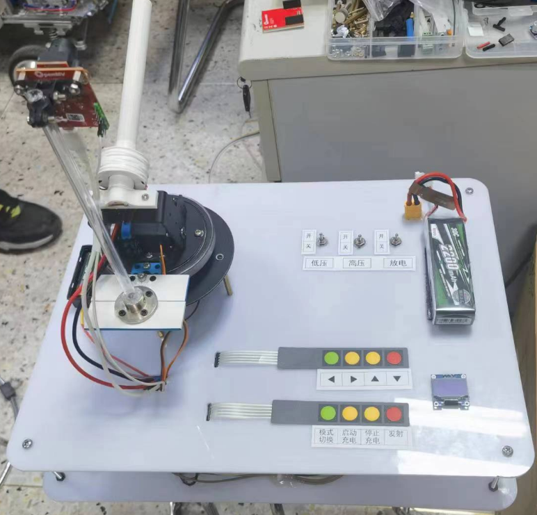
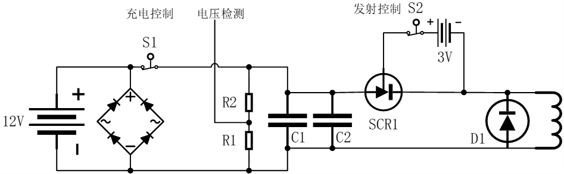

<!--
    代码设计和代码结构，面向对象的C语言思想实践。NXP芯片，图像处理初步。
-->
# 模拟电磁曲射炮设计

此项目为 2019 年电子设计竞赛 H 题。当时使用 NXP RT1052 芯片作为主控，裸机开发所有功能，发射精度还是不错的。

<figure>
    
</figure>

2019 的电磁炮

2023 年重新整理一下这个项目，改用 STM32 基于 rt-thread 实现所有功能。并且做的更细致了一些

<figure>
    
</figure>

## 电赛 H 题

### 任务

自行设计并制作一模拟电磁曲射炮（以下简称电磁炮），炮管水平方位及垂直仰角方向可调节，用电磁力将弹丸射出，击中目标环形靶，发射周期不得超过 30 秒。电磁炮由直流稳压电源供电，电磁炮系统内允许使用容性储能元件。

### 要求

电磁炮与环形靶的位置示意如图 1 及图 2 所示。电磁炮放置在定标点处，炮管初始水平方向与中轴线夹角为 $$ 0 \degree $$ 、垂直方向仰角为 $$ 0 \degree $$ 。环形靶水平放置在地面，靶心位置在与定标点距离 $$ 200 \text{cm} \le  d \le 300 \text{cm} $$ ，与中心轴线夹角 $$ \alpha \le \pm 30 \degree $$ 的范围内。

<figure>
    
    <figcaption>图 1 电磁炮与靶的位置</figcaption>
</figure>

<figure>
    
    <figcaption>图 2 电磁炮与靶的位置</figcaption>
</figure>

## 方案设计

### 总体设计

总体设计如下所示

<figure>
    
    <figcaption>总体设计</figcaption>
</figure>

一些设计上的点：
- 主控 MCU 选用 STM32F407
- 按键使用了按键库[jiejieTop/rtpkg_button](https://github.com/jiejieTop/rtpkg_button)
- 信息显示包括 SSD1306 驱动的 OLED 以及蜂鸣器
- 目标识别使用 OpenMV 实现，通过串口将目标所在的像素坐标发送至主控 MCU
- 发射控制包含了充电控制、充电电压检测、发射控制三个部分

### 发射模块设计

这其中发射模块是这个项目里比较重要的东西，需要自己造一下。发射模块的设计如下图

<figure>
    
    <figcaption>发射模块设计</figcaption>
</figure>

<figure>
    
    <figcaption>发射模块电路图</figcaption>
</figure>

发射模块需要两个 GPIO 和一路 ADC 来实现充电检测和发射控制等功能。

## 软件设计

项目以 MCU 为核心，OpenMV 当作 “目标检测传感器” 来使用，按照约定好的格式通过串口不断返回目标点的像素坐标。此项目基于 rt-thread 开发，

### openMV

### MCU

