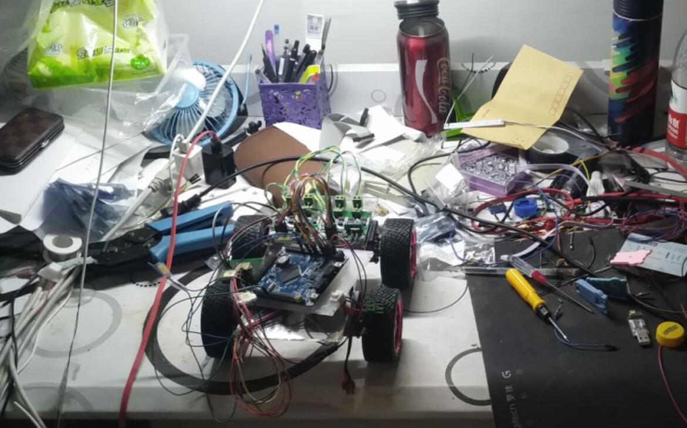
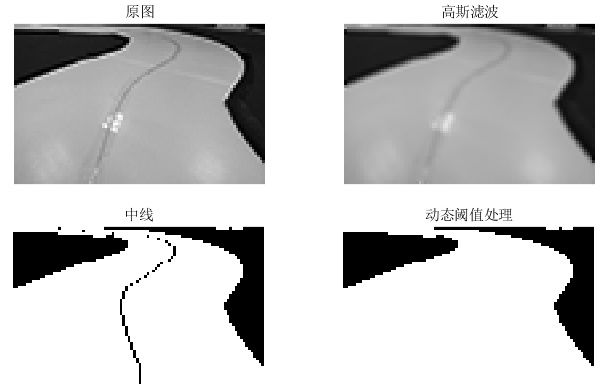
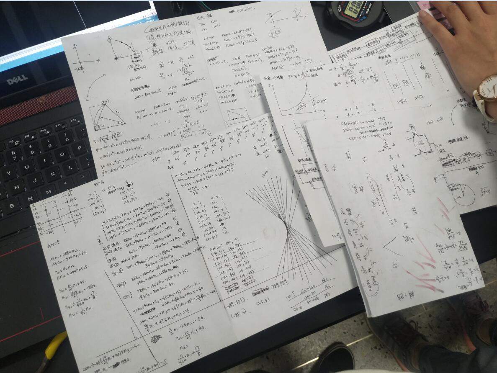
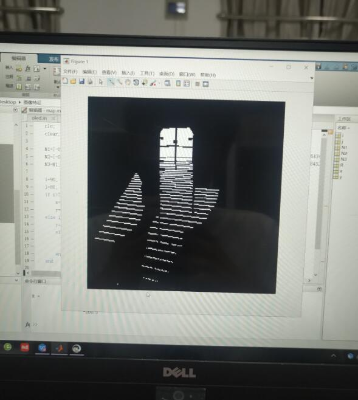

<!--
    代码设计和代码结构，面向对象的C语言思想实践。NXP芯片，图像处理初步。
    
-->
## 前言

这是一个关于我大学本科期间参加过的智能车比赛的总结。

还有另一个

### 智能和5G

（以下仅都是个人观点，不一定准确）

我感觉“智能”个词就和“5G”一样，有点虚空。智能和5G有点像是面向消费者的，对于开发者来说，这不像是一个小范围准确的概念。就比如说智能扫地机器人、智能网联汽车、5G智慧家居。

😂😂😂这些词听着就花里胡哨，似乎智能和5G可以放在所有需要变得高端的产品上去。

智能包含了这几个方面的含义：人机交互性好、能上网冲浪、会自己动。

大四的时候过年在家，再一次往常的饭后聊天中我爸说“无人驾驶智能汽车发展的不错，5G概念股将来肯定有前途”

5G时代是物联网时代。没有5G的时候就有物联网了，我前公司的物联网模块甚至用的是2G的（2020年9月还是），消费级产品肯定对延迟没有过分严格的要求，至于工业控制，都用到物联网了，延迟高个几十毫秒甚至几百毫秒问题不大。如果有人说我必须要低延迟做实时控制，延迟高了会损坏机器有财产损失。这一看就是厂都没进过，纯外行。

### “智能”车项目时间分配

终于回到车了，这里的智能指的是会自己动，所以核心肯定是自动控制算法了。

前几天在B站关注了个账号[@阳光小创客](https://space.bilibili.com/525916013/)，里面有个小学二年级的小朋友做两轮自平衡车

<iframe src="//player.bilibili.com/player.html?aid=589500561&bvid=BV1Kq4y197jE&cid=382022839&page=1" scrolling="no" border="0" frameborder="no" framespacing="0" allowfullscreen="true"> </iframe>

怎么说呢？这不比我接下来要搞得四轮趴地车有牌面嘛？现在我每天醒来去刷刷这些视频，提醒自己二年级小朋友都能搞出来，不要觉得自己有多厉害，小学二年级水平罢了。

所以说车是个下限很低上限很高的东西，小朋友也在玩，家里的扫地机器人也可以归结到二轮差速转向车的范围内（三轮其中一个无动力）。

这其中最能体现车和车不一样的地方是算法。所以一个这个入门项目我认为时间比例要控制好，如果是自己从底层元件开始搭一辆车，时间比例`硬件：软件：算法=1:1:2`；如果买现成的硬件自己写软件和算法那么`软件：算法=1：2`；如果买了个啥都有的车，那么和上面的二年级小朋友一样直接就可以玩了。（没有贬低小朋友的意思，小朋友很厉害！就算全是买的，能让他动起来也很有前途，能讲出来就更有前途了）

### 看看成品

这是我大二快结束参加大学生智能汽车竞赛的车，虽然说了一大堆，但是最后只拿了个华东二等奖😂😂😂😂。说明还是差点意思。

<figure>
	
</figure>

这辆车是从底层开始一路整上去，真是磨练人，倒是现在想起来那两个月还是挺开心的。。

在这辆车之前还搞过一个差速的小车，没有自己做硬件，买的成品电路板，插杜邦线。传感器也是单点灰度检测白线的，正经的大一大二电子综合入门小项目😂😂。

<figure>
	
</figure>

当时大一学完了C语言，然后刚开始学数字电路，只是觉得好玩，和旁边的舍友一起熬夜，他打游戏我搭车，还是挺欢乐的😂。

## 基石——稳定可靠的硬件

这硬件设计怎么说呢，当时搞这个只是学会了用EDA软件，真正原理图啥的还是四处参考借鉴，到后来工作了发现也差不多是这样，只是说见的原理图多了，面对不同的需求能越来越快的拿出一套可行的方案。

硬件一定是基础，如果搞了个电路板每天电容放炮，左边冒烟修好了右边冒烟，MCU总是复位重启，哪还有做算法的机会。

<figure>
	
</figure>

硬件重在一个细节，各种细节，原理图细节、封装细节、PCB布局布线细节、焊接细节、调试细节。

这个车的硬件还是比较简单的，MCU用的BGA封装芯片，自己画的打样成本过高（18年四层板5cm以内5块好像400，现在便宜太多了），买一个核心板也才100多，不画核心板的话就剩供电和MCU接口、电机驱动这两个了，都很基础，完美符合大二入门项目“入门”的要求。

电机驱动就是一个简单的H桥，用的还是集成芯片，供电的话，根据不同电压等级选对应芯片，芯片手册里都有参考设计，也很简单，接口引出就是字面意思。这里就不放原理图了。直接看看PCB。

<figure>
	
</figure>

## 清晰的接口

前面时间分配把软件和算法分开了，算法是软件的一部分这么说也没啥问题，毕竟这两个东西表面看起来都是代码。

这里的软件严格的讲是驱动代码，算法调用驱动接口函数，有点分层设计的意思。这么设计更清晰，出了问题调试起来更容易。小项目随便整代码当然没啥问题，当时项目大了，代码还随便写就容易出大问题。

其实驱动这一部分用个嵌入式实时操作系统也挺好的，虽然代码看起来复杂了当时设计起来却简单了。代码风格也是，不是为了花里胡哨的，表面代码的复杂是为了逻辑上的清晰。


## 灵魂——算法，车与车的根本区别

### 图像部分

这里实际上还是对图像的简单处理，毕竟不是专门做图像算法的。

原始图像处理

高斯滤波，实际上就是模糊一下。

<figure>
	
</figure>

<figure>
	
</figure>

动态阈值法，二值化

<figure>
	
</figure>

到这一步以后，其实就可以做无脑的方向控制了，究极好用无脑<a href="{{ site.url }}/0.%E6%B2%A1%E5%88%86%E7%B1%BB%E7%9A%84%E6%96%87%E7%AB%A0/2021/08/19/PID.html" target="_blank">万能PID</a>就完事了。

当然如果为了对车做更精确的控制，也可以再进一步。

前面的部分都是我在做、我可以理解的，从这里开始，我就变成了站在旁边给队友拍手的了。也正是从这里开始，我真正意识到了数学建模+算法的威力，此前我认为工程可以解决任何问题，数学建模+算法只是给动手能力差一点的人用来消遣的。现在看起来这个想法态没有见识了。

数学能力跟上来后，我也逐渐理解当时队友搞得这套到底是什么东西了。

<figure>
	
</figure>

<figure>
	
</figure>

采集了的相机图像直接用各种PD，搞几套几十套参数根据偏差大小、偏差变化率自动调整当然也没问题，比赛中有好多车都是这么调的，而且成绩相当不错。当时问题是，梅遇到一辆不同的车，都要重新整这些参数，这间花费相当长的时间。

这里使用了逆透视+车模阿克曼模型，计算前轮转向角。

<figure>
	
</figure>

<figure>
	
</figure>

当时这个逆透视图出来的时候，我大受震撼。

做算法的两个队友的核心工作体现在了一个只有200行代码的.c文件里，当时我觉得他连的工作比我几千行的驱动代码要更重要也更有价值。当然我的代码我画的板子也很重要😁😁，这是算法好用的基石。（里面的数据结构接口也是我写的）。

可以去我的Github[查看源码](https://github.com/Meng2025/IntelligentCar/blob/master/driver/camera/img_calculate.c)，这里摘出一部分。
```c
* 逆透视变换矩阵 */
const double N1[8] = { -0.0649852534450704,2.53734549914701,-240.905004855923,1.72242380270896,-0.115684719493100,423.076434304688,0.130208451031495,-0.00342074612370382 };
const double N2[8] = { -0.0108680223123130,1.74103387838086,-172.804762452853,1.48135911232730,-0.324225542774878,294.738452846723,0.0903126321121198,-0.00636880777526755 };
const double N3[8] = { -0.0649852534450704,2.53734549914701,-240.905004855923,1.72242380270896,-0.115684719493100,423.076434304688,0.130208451031495,-0.00342074612370382 };

/* 坐标变换函数：像素坐标->实际坐标 */
static point_t img_locaion_transform(uint16_t pix_i, uint16_t pix_j) //坐标变换函数，输入行&列，返回结构体
{
	point_t real_coordinate;
	if (pix_i < 50)
	{
		real_coordinate.x = (N3[0] * pix_i + N3[1] * pix_j + N3[2]) / (N3[6] * pix_i + N3[7] * pix_j + 1) + 0.9;
		real_coordinate.y = (N3[3] * pix_i + N3[4] * pix_j + N3[5]) / (N3[6] * pix_i + N3[7] * pix_j + 1);
	}
	else if (pix_i > 70)
	{
		real_coordinate.x = (N1[0] * pix_i + N1[1] * pix_j + N1[2]) / (N1[6] * pix_i + N1[7] * pix_j + 1) + 0.9;
		real_coordinate.y = (N1[3] * pix_i + N1[4] * pix_j + N1[5]) / (N1[6] * pix_i + N1[7] * pix_j + 1);
	}
	else
	{
		real_coordinate.x = (N2[0] * pix_i + N2[1] * pix_j + N2[2]) / (N2[6] * pix_i + N2[7] * pix_j + 1) + 0.9;
		real_coordinate.y = (N2[3] * pix_i + N2[4] * pix_j + N2[5]) / (N2[6] * pix_i + N2[7] * pix_j + 1);
	}
	return real_coordinate;
}

/* 三点（实际坐标）算曲率 */
static double _img_curvature(point_t A, point_t B, point_t C)
{
  /* 三边长和三角形面积 */
	double AB, BC, AC, S;
	AB = distance(A, B);
	AC = distance(A, C);
	BC = distance(B, C);
	S = fabs((B.x - A.x)*(C.y - A.y) - (C.x - A.x)*(B.y - A.y)) / 2;  //三点构成的三角形面积
	return (4 * S / (AB*BC*AC));
}

/* 赛道半径计算函数，返回单位cm */
static double _img_calculate_r(void)
{
  /* 三点算曲率 */
	point_t A, B, C;
  /* 边线数组指针 */
  int16_t *p_line;    
  /* 左弯曲率用右边算 */
  if (status.img_roadtype == RoadLeft)
    p_line = rightline;
  /* 右弯曲率用左边算 */
  else if (status.img_roadtype == RoadRight)
    p_line = leftline;
  else  /* 程序出错。直路不进入此函数 */
    return 0;
  
  /* 像素位置逆透视为实际位置，这三行位置可以改变 */
	A = img_locaion_transform(70, p_line[70]);
	B = img_locaion_transform(60, p_line[60]);
	C = img_locaion_transform(50, p_line[50]);  

	/* 半径 = 1/曲率 */
  return (1/_img_curvature(A, B, C));
}
```
这些神秘数字，让当时只会搬运代码的我看到怎么能不受震撼。只能站在旁边拍手直呼NB。


（没写完。后面有时间再补充）

### 车本体方向控制


### 电机控制

