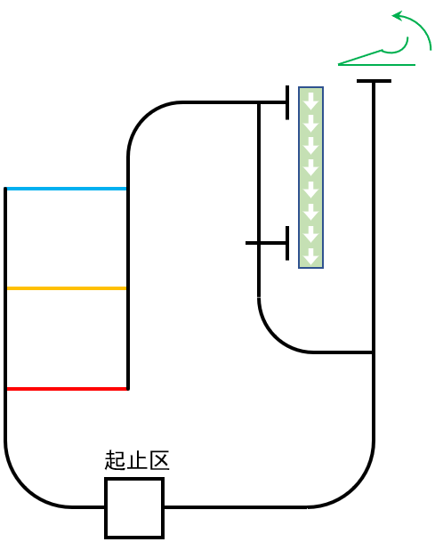
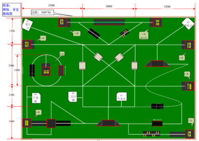
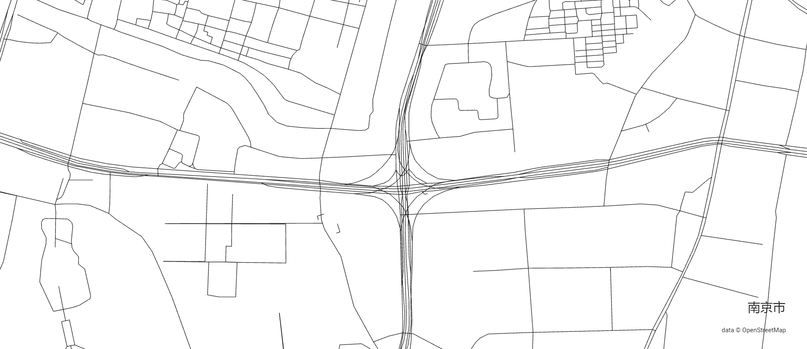
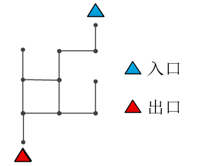
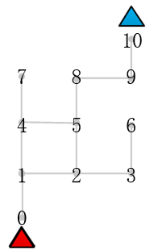
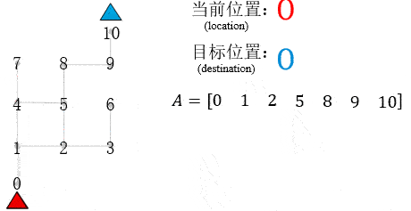
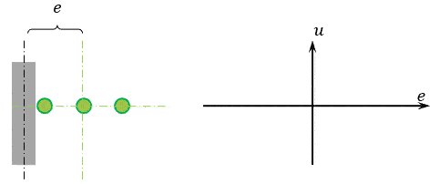
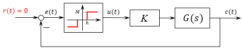

<!--
    循迹机器人，
    入门项目，控制理论与图算法的实际应用
-->
## 1. 前言

这是一个关于循迹小车类竞赛的总结。

2018年我第一次参加机器人比赛，江苏省大学生机器人竞赛的一个项目：机器人探险游，这是一个标准的循迹机器人竞赛项目。现今我在一个担任嵌入式软件工程师，公司作为RoboCom的供应商，负责其中两个项目的规则制定，顺便卖比赛用的设备。时隔4年，我又再次开始调试循迹小车。

循迹小车也是电子设计新手入门的一个项目，可以说是电子设计的"Hello World!"。积累了一些开发经验后再次去调试作为入门小项目的循迹车，也有一些新的想法，这里我从控制与规划的角度出发，总结一下循迹类竞赛项目的一个通用的解决思路。

## 2. 循迹类机器人竞赛项目

先来看看一些典型的循迹小车类的竞赛项目。

### 2.1 2022RoboCom：火线速递

<figure>
    
    <figcaption>比赛地图</figcaption>
</figure>

小车在起止区任意夹取红黄蓝三个物块中的一个，走颜色对应的线路将物块放置在传送带出发点，然后去传送带结束点重新夹取物块送到投掷点，最后返回起止区。

这个比赛除了循迹小车，传送带与抛投装置也需要自己设计，不过这不重要，我们只关心小车的问题。

比赛任务有比较简单的**选路**的问题需要去解决。

### 2.2 2022RoboCom：智慧果园

识别路牌，去指定位置摘取果实，放到回收筐，摘的越多分数越高，计时结束前要到达停车区。

这个比赛除了循迹底盘，还有图像识别和舵机机械臂的问题需要解决，不过这也不重要，我们只关心循迹底盘运行的问题。

比赛任务有**从当前位置运行到目标位置**的问题需要去解决。

### 2.3 江苏省大学生机器人竞赛：探险游

去的地方越多，得分越高，不指定路线，计时结束前要回到发车区。

这个比赛是个纯循迹车的问题，在循迹稳定的基础上，有了地图的影子在里面。

比赛任务有初步的**规划**的问题需要去解决。

<figure>
    
    <figcaption>比赛地图</figcaption>
</figure>

## 3. 循迹车核心硬件介绍

抛开具体的比赛上的任务，循迹车或者循迹底盘最根本的要求是要跟着线跑，因此我们只关心检测白线的传感器和实现底盘运动的电机。

### 3.1 传感器

灰度传感器，检测白线，1bit的数字量输入。

### 3.2 电机

电机是整个机器人系统控制的最终环节。不论什么机器人，上层算法的运算结果最终落实到底层都是要靠电机来实现运动。对于比较简单的循迹小车可以简单的认为控制算法就是根据灰度传感器去计算一个合适的电机电压（PWM占空比）达到对整个底盘运行的控制。

## 4. 不同比赛的共同问题

前面的三个比赛我们把场地拿出来，去掉干扰元素，单独看看：

(拓扑地图)

这种方式和导航软件很接近了，城市地图也可以用这种方式来表达。这里有个网站[city-roads](https://anvaka.github.io/city-roads/)，输入城市名就可以看到路网信息：

<figure>
    
    <figcaption>南京市-双桥门立交</figcaption>
</figure>

后面用一个极度简化的**图**来说明问题：

<figure>
    
    <figcaption>循迹竞赛地图</figcaption>
</figure>

为了方便描述，也为了用计算机去解决问题，给这个图标的每个点都标上号：

<figure>
    
    <figcaption>循迹竞赛地图</figcaption>
</figure>

### 4.1 引导的问题

任务是从红色入口点0前往蓝色出口点10，生而为人，我们**一眼**就可以看出机器人要走的路为

把这条路告诉机器人，相当于人为机器人找了条路

<figure>
    
    <figcaption>循迹竞赛地图</figcaption>
</figure>

图很好看，但是这个直观想法还是没法直接用，需要一种更加靠近具体实现的实现方法来引导小车。这里给出一种比较简单的想法：

<figure>
    
    <figcaption>引导前进</figcaption>
</figure>

注意到当前位置和目标位置这两个数字对运行过程的影响，这幅图可以用程序去实现出来，也是一种比较简单的循迹小车在地图上的引导方式。

有了上述方法，对付循迹类的比赛已经够用了，比如说火线速递找路的问题，我们可以先写下ABC三条路，识别颜色后按照事先人的规划逐步运行。对于探险游，人去规划要去的地方，小车逐步去运行。

我们不妨更深入一点，能不能让循迹小车自己去找一条路呢？即我们告诉车他在1，他要去10，车自己找了条路，自己去走。

实际上，ROS开发的机器人里，有了环境地图，也会有路径规划的问题。


### 4.2 循迹与方向控制的问题

找路的问题解决了，还有个很重要的问题，比如说从0去1，为什么就能跟着线到达呢：

<figure>
    
    <figcaption>引导前进</figcaption>
</figure>

这就是循迹问题，或者说方向控制的问题。对于只有3个bit的灰度传感器来讲，会把车中线到引导线的距离偏差在软件上输出为一个非线性特性：

<figure>
    
    <figcaption>灰度传感器</figcaption>
</figure>

引导线跑到灰度外面就失控了，因此不考虑偏差过大的情况，那么可以用这个函数来描述3bit灰度传感器的特性：

<figure>
    
    <figcaption>灰度传感器</figcaption>
</figure>

这是一个典型的**带死区的继电特性**。以实际偏差作为反馈量画出方向控制框图：

<figure>
    
    <figcaption>灰度传感器</figcaption>
</figure>

虽然方向相关的具体传递函数不知道，但是我们也大概可以判断，这个非线性特性可能会使得车头方向控制出现震荡。

### 4.3 位置点判定

这里就很容易了，检测十字路口，简单的判断灰度就行。没有太多思维上的难度，再使用逻辑条件进行判断时，‘与’和‘或’可以使得判断条件变得‘严格’或者‘宽松’以适应不同的任务。

这种判定方式严重依赖灰度传暗器，不允许有任何判断的上的偏差，实际上车并不知道自己在哪里。

这实际上是一个简化的定位问题，数脚下经过的十字路口数是一种可以但不优雅的方式。

UWB（ultra wide band）定位技术比较适合于这种应用场景，特别细节的定位原理暂时先不关心，先用起来。

基站+标签，基站的位置是知道的，测量标签到不同基站的距离，就可以获得标签的位置。

因此单个基站只能测量距离，要想确定空间位置则需要4个基站。


## 5. 具体问题的程序实现

### 5.1 引导

基于当前位置和目标位置的思路，需要两个位置状态来表示车的情况

```c
typedef struct
{
    unsigned char location;         /* 当前所在位置 */
    unsigned char destination;      /* 目标位置 */ 
} status_t;

```

在程序开始时，我们可以告诉车所处的位置与目标位置

```c
status_t status;

status.location = 0;
status.destination = 10;
```

然后设计一个函数去接收这两个参数，

```c
void auto_run(unsigned char loc, unsigned char des);
```

这个函数给人的感觉就是用来指挥车的，先来考虑一种最简单的情况，一条路走下去。很容易想到for循环，这种思路是把一整个路程拆分成一段一段来走，只要保证单步可靠运行，那么整条路跑起来也是没啥问题的。

```c
void auto_run(unsigned char location, unsigned char destination)
{
    find_road(location, destination, road)
    for (int i = location + 1; i <= destination; i++)
    {
        auto_drive_fun_lst(i);
    }
}
```
一整段路拆成单步执行，这里需要一个单步函数列表，可以用函数指针去实现，当然也可以用switch语言，更容易想到

```c
static void auto_drive_fun_lst(unsigned char destination)
{
  switch (destination)
  {
    case '1' : auto_0_1(); break;
    case '2' : auto_1_2(); break;
    case '3' : auto_2_3(); break;
    case '4' : auto_3_4(); break;
    case '5' : auto_4_5(); break;
    case '6' : auto_5_6(); break;
    case '7' : auto_6_7(); break;
    case '8' : auto_7_8(); break;
    default  : break;
  }
}
```
在单步运行函数里，只需关注每段路上的东西就可以了。

智慧果园项目里，到这一步就已经够用了

### 5.2 规划

在火线速递或者探险游的比赛里，有选路的问题，一种方法是提前写好走哪条路，比如说

$$ A = [1 3 5] $$

在程序里，使用一个数组来保存路线信息：

```c
unsigned char road_a[] = {1, 2 ,3 ,4 ,5 ,8, 10, 9 ,1}; 
```

```c
void auto_run(unsigned char *road, unsigned char num)
{
    for (int i = 1; i < num; i++)
    {
        auto_drive_fun_lst(road[i]);
    }
}
```

更进一步，如果想实现在线找路，即告诉所在位置和目标位置，自动找出数组a，然后开始运行

```c
const unsigned char map[][2] = {
    {0, 1}, {0, 3},
    {1 ,4},
    {2, 3}, {2, 5},
    {3, 4}, {3, 7},
    {4, 5}, {4, 8},
    {5, 9},
    {6, 7}, {6, 10},
    {7, 8}, {7, 11},
    {8, 9}, {8, 12},
    {9, 13},
    {10, 11},
    {11, 12},
    {12, 13},
};
```

使用DFS搜索算法，也可以找出一条路来：


### 5.3 循迹控制

```c
/* 前进时候的位置偏差 */
signed char gray_front_error(void)
{
  u8 temp = (GRAY_F_L << 2) | (GRAY_F_M << 1) | GRAY_F_R;   //灰度拼接起来
  signed char err;    /* 位置偏差 */
  switch (temp)
  {
    case 0x03:          // 011
      err = -1;
      break;
    case 0x06:          // 110
      err = 1;
      break;
    default:            // 101 白线在中间，111 跑出去了
      err = 0;
      break;
  }
  return err;
}
```

```c
/* 前进循迹 */
void track_drive(track_speed_t s)
{
  motor_move(s, 260 * gray_front_error());
}
```

### 5.4 位置检测

```c
bool gray_is_cross(void)
{
  return
      ((GRAY_L_F && GRAY_L_M && GRAY_L_B) ||
       (GRAY_R_F && GRAY_R_M && GRAY_R_B) ||
       (GRAY_F_L && GRAY_F_M && GRAY_F_R) ||
       (GRAY_B_L && GRAY_B_M && GRAY_B_R)) == 0;
}
```

## 程序框架

### 工程结构

### 工程结构与命名规范的重要性


