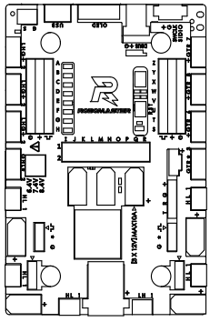
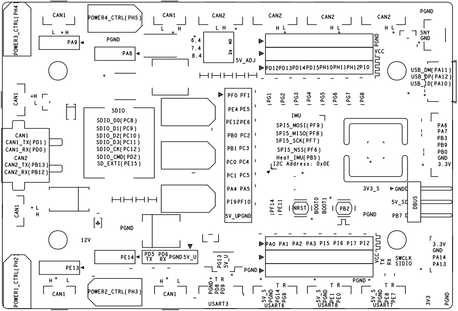
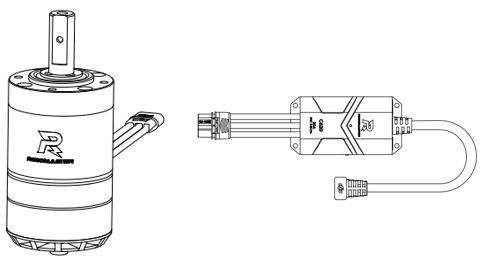
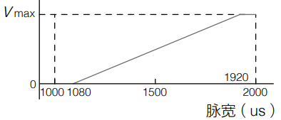
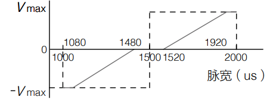
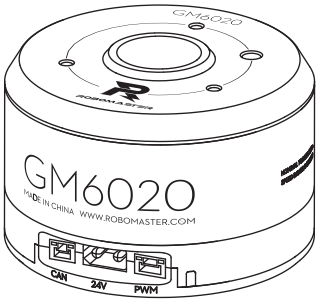
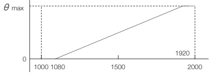
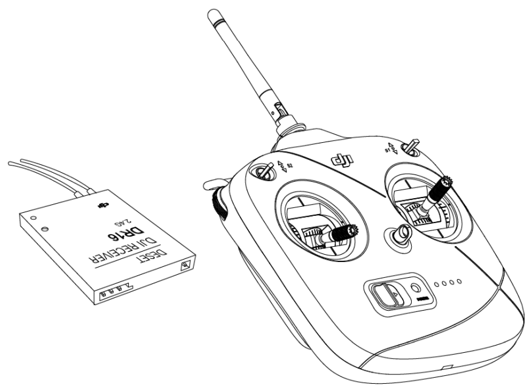

## RoboMaster比赛介绍

## 步兵机器人功能需求

## 硬件介绍

### 开发板

<figure>
    
</figure>

开发板丝印和引脚定义图

<figure>
    
</figure>

### 电机

#### 底盘电机

M3508,C620

<figure>
    
</figure>

控制方式1：CAN通信

电调绿灯闪烁次数为ID号，可以通过电调上的SET键来设置电调ID号。长按SET可以校准电机，发挥电调最大性能。

控制发送，

帧ID 0x200，标准数据帧8字节

|  数据   |  电调ID   |  数据含义   |
| :-----: | :-------: | :---------: |
| DATA[0] | **电调1** | 电流值高8位 |
| DATA[1] | **电调1** | 电流值低8位 |
|   ...   |    ...    |     ...     |
| DATA[6] | **电调4** | 电流值高8位 |
| DATA[7] | **电调4** | 电流值低8位 |

帧ID 0x1FF，标准数据帧8字节

|  数据   |  电调ID   |  数据含义   |
| :-----: | :-------: | :---------: |
| DATA[0] | **电调5** | 电流值高8位 |
| DATA[1] | **电调5** | 电流值低8位 |
|   ...   |    ...    |     ...     |
| DATA[6] | **电调8** | 电流值高8位 |
| DATA[7] | **电调8** | 电流值低8位 |

电流数据范围：-16384, 16384，对应实际电流-20A, 20A

返回数据
帧ID 0x200+电调ID，标准数据帧8字节

|  数据   |   数据含义    |
| :-----: | :-----------: |
| DATA[0] |   转角高8位   |
| DATA[1] |   转角低8位   |
| DATA[2] |   转速高8位   |
| DATA[3] |   转速低8位   |
| DATA[4] | 实际转矩高8位 |
| DATA[5] | 实际转矩低8位 |
| DATA[6] |   电机温度    |
| DATA[7] |     NULL      |

转角数值 0-8191 对应0-360°

转速单位 rpm

PWM控制方式

单向模式
<figure>
    
</figure>

双向模式
<figure>
    
</figure>

#### 云台电机

GM6020

<figure>
    
</figure>

CAN通信控制

拨码开关设置电机ID

控制发送，

帧ID 0x1FF，标准数据帧8字节

|  数据   |  电调ID   |  数据含义   |
| :-----: | :-------: | :---------: |
| DATA[0] | **电机1** | 电压值高8位 |
| DATA[1] | **电机1** | 电压值高8位 |
|   ...   |    ...    |     ...     |
| DATA[6] | **电机4** | 电压值高8位 |
| DATA[7] | **电机4** | 电压值高8位 |

帧ID 0x2FF，标准数据帧8字节

|  数据   |  电调ID   |  数据含义   |
| :-----: | :-------: | :---------: |
| DATA[0] | **电机5** | 电压值高8位 |
| DATA[1] | **电机5** | 电压值高8位 |
|   ...   |    ...    |     ...     |
| DATA[4] | **电机7** | 电压值高8位 |
| DATA[5] | **电机7** | 电压值高8位 |
| DATA[6] |   NULL    |    NULL     |
| DATA[7] |   NULL    |    NULL     |

电压给定范围 -30000,+30000

返回数据
帧ID 0x204+电机ID，标准数据帧8字节

|  数据   |   数据含义    |
| :-----: | :-----------: |
| DATA[0] |   转角高8位   |
| DATA[1] |   转角低8位   |
| DATA[2] |   转速高8位   |
| DATA[3] |   转速低8位   |
| DATA[4] | 实际转矩高8位 |
| DATA[5] | 实际转矩低8位 |
| DATA[6] |   电机温度    |
| DATA[7] |     NULL      |

转角数值 0-8191 对应0-360°

转速单位 rpm

PWM控制方式

50Hz

速度模式
<figure>
    
</figure>

位置模式
<figure>
    
</figure>

模拟舵机，中点位置与转角范围可控。

#### 其他电机
M2006+C610

<figure>
    
</figure>

### 遥控器

<figure>
    
</figure>

### 接线

摩擦轮电机，12V，PE14

储弹仓电机M2006，24V,POWER2，CAN1

## rt-thread 介绍

## 开发板 bsp 制作与驱动配置

pin serial can pwm

## 任务设计思路

硬件相关的，用于数据收发线程的设计

## 麦克纳姆轮底盘运动

## 控制相关任务

