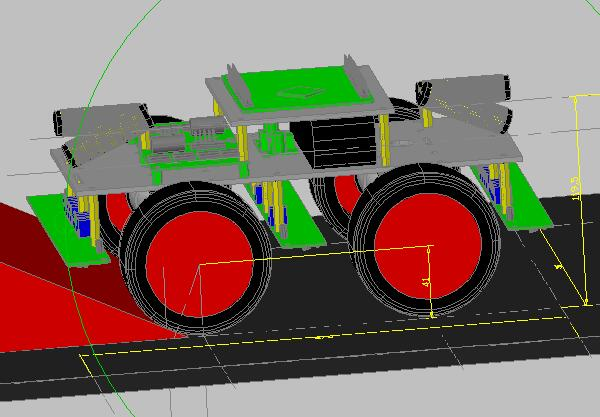
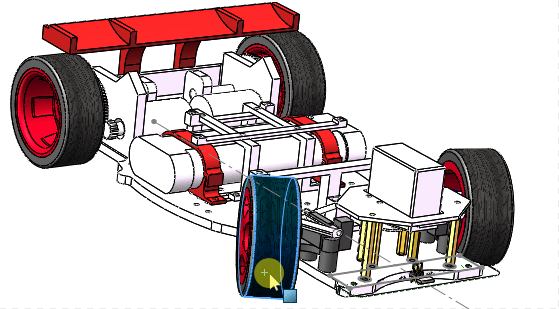
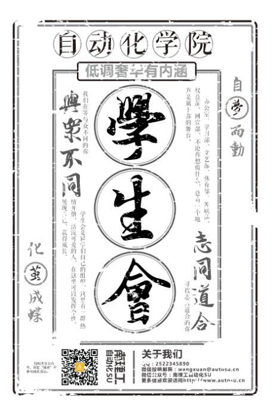
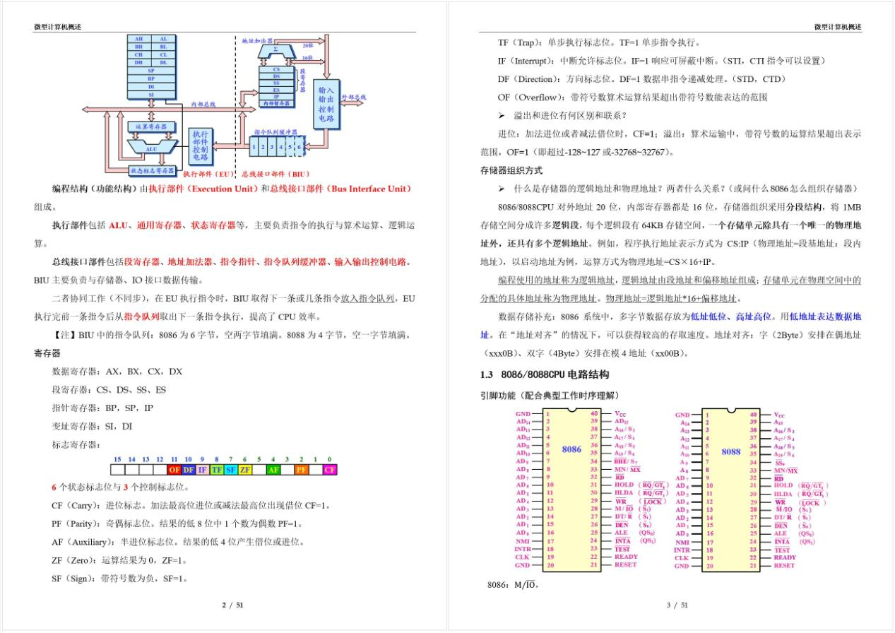
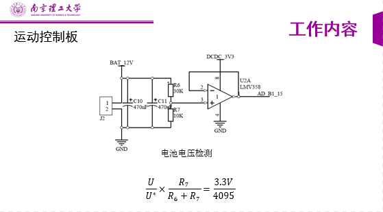

### 教育与工作经历

||||
|:-:|:-:|:-:|
| 2022.9 - 至今 | 硕士在读 | **导航、制导与控制**专业 |
| 2020.6 - 2022.9 | 嵌入式软件工程师 | MCU与RTOS，移动机器人、关节机器人 |
| 2016.9 - 2020.6 | 工学学士 | 电气工程及其自动化专业，电力电子与电机方向 |

### 荣誉与奖项

- 2020届校级优秀毕业设计个人（基于ROS的激光导航智能车）
- 2020届校级优秀毕业设计团队
- 2019电子设计竞赛江苏省一等奖
- 2018大学生智能汽车竞赛华东赛区二等奖
- 2018江苏省大学生机器人竞赛三等奖
- 校级优秀学生会干部

### 核心技能

**编程语言：**

C/C++, Python

||||

熟悉的框架

ROS1 RT-Thread freeRTOS LVGL Qt

熟悉的芯片

ST,NXP

 

熟悉的电子开发软件

Altium Designer，Keil，IAR，Multisim，Proteus

**电子开发相关：**

|||||

中低速1GHz以内、4层及以下原理图和PCB，熟练使用模拟数字电路仿真工具。ARM内核MCU开发，有操作系统也凑合可以搞，正在学习操作系统原理。

|||

MATLAB是个很复杂的工具，我只熟悉控制系统仿真。

 

**开发效率工具：**

git,github,vscode,

||||

合作开发，clone开源代码没有任何问题🤔🤔。

 

### 其他技能

**会用的：**

|||

只是会用软件，不懂机械原理和机械设计。常用AutoCAD画各种插图，还是挺好用的。

比如 AutoCAD 画的一个控制系统频域校正图

<figure>
    
</figure>

以及早期小比赛自己买零件组装车，使用AutoCAD做过三维设计：

<figure>
    
</figure>

一言难尽。

后来比赛的时候用Solidworks画的一个车模，从零件到装配全都做，然而好像对比赛并没有实质性帮助😂😂

<figure>
    
</figure>

 

**一些不是特别重要的技能：**

|||||

大学本科时期曾任学院宣传部部长，做过各种宣传的东西。具备简单的海报、传单设计能力，基础排版，PPT制作。

曾经做过的一些东西：

- (2017)学院学生会招新时候用的宣传单，PS和AI都有用到
  
<figure>
    
</figure>

>思路就是要特别，传单这个东西做的太普通就没有吸引力了。主体突出，目标明确，最后效果还是不错的😂。

- (2019)WODR排版，一个微机原理与接口技术的知识点小册子

<figure>
    
</figure>

>排版这个事情大概就是注意细节吧。我的经验是“整体感”，排版的时候字体字号间距，插图配色要让一整页看起来是一个整体。

- (2020)PPT，算是产品展示或者是项目总结吧

<figure>
    
</figure>

>PPT制作主要还是看演讲人的思路，因此我自己做演讲的时候PPT里图多，特别关键的文字才放上去，动画要去配合演讲人的思路。

设计这个东西我觉得软件只是工具，更重要的还是思路，如何逻辑清晰的传达自己的观点、想法，除了语言还使用视觉辅助传递信息，这些工具使得好的思路锦上添花。

tips：附带图片展示的技能都仅仅是兴趣，并不专业。

