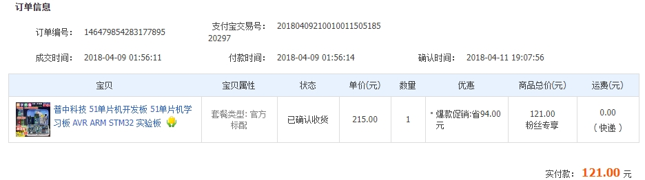

<!-- 单页 -->

&nbsp;

#### 教育与工作经历

| 📅 | 💼 | 🛠 |
|:-:|:-:|:-:|
| 2022.9 - 至今 | 硕士在读 | **导航、制导与控制**专业，毕业时间 2025.4 |
| 2021.2 - 2022.9 | 嵌入式软件工程师 | 移动机器人、运动控制、rt-thread、单板软硬件 |
| 2020.6 - 2021.1 | MCU 开发工程师 | 线控底盘，单板软硬件开发 |
| 2016.9 - 2020.6 | 本科在读 | 电气工程及其自动化专业，电力电子与电机方向 |

#### 核心技能

- **MCU 开发相关**：熟悉 arm cortex-m 内核，RTOS，运动控制；能独立完成低速单板硬件开发与调试，熟悉数字电路与模拟电路。
- **RTOS 开发(rt-thread)**：熟悉多线程、线程同步与通信、bsp 开发、I/O 设备驱动框架、sensor 驱动对接；曾向 rt-thread 开源项目提交 bsp 软件包 PR，并合并到主分支(针对使用STM32 和 NXP i.mxrt1061 芯片的开发板)。 
- **控制理论相关**：熟悉 pid、LQR、最优控制，熟悉永磁同步电机控制原理与控制方法，了解 FOC 算法与实现。
- **嵌入式 linux 开发**：了解uboot、kernel适配流程、根文件系统制作(busybox、buildroot)、镜像构建，了解设备树与 linux 驱动开发(字符设备驱动)，了解 gcc、gdb、makefile、git 等开发工具的使用，能写简单的 shell 脚本。

#### 关于我编年史 or 学习生涯回顾

- 上世纪 - 2016 年：平平无奇的小学初中高中生活，游戏是无聊的学习生活中唯一能让人感到兴奋的东西。在互联网并不发达的年代，买盗版游戏光盘是获得新游戏唯一的方式。盗版游戏的不稳定或是夹杂的病毒流氓软件不知道多少次让家里的 windows XP **番茄花园版**崩溃，为了避免挨打我从小就练了一手装系统的技能。2010 年前后在我那个西北小县城，找电脑店装一次要 50 元，以至于后来邻居家的电脑一有问题也来找我。后来家里终于通网了，2Mbps 的 ADSL 向我灌输着各种和游戏相关的电脑知识，比如：为了和同学联机打红警去给电脑配网；我的世界比较火的那段时间，自己搭了个游戏服务器；穿越火线有个 4 人的挑战模式，有段时间可以用 CE 修改器把 4 人房间改成 32 人...(这个做的有点过分了😂)。现在想想，这些实践可能就是对我计算机学习的一些最初的启蒙吧。

- 2016 年我来到南京读大学，一切都是新鲜的，我加入了学院学生会的宣传部(**伏笔**)。入学第一年除了数学物理基础课，居然大一上就开了 C 语言课。但是谭浩强的书和面向考试学习的编程把人折磨的不轻，诸如手算 `i++ + ++i` 之类的。

- 2017 年的国庆过完，我大二了，成为了宣传部部长，正好我们学院举行机器人大赛，需要去拍照写文章发新闻稿。当时我举着相机，看着别人搞得会自己跑的小车感觉超级厉害。给这个比赛拍完照以后，一些种子在我心里种下了，我觉得自己能动手做一个东西是一件很好玩的事情。

- 2018 年，过完年的新学期，大二下学期开了模拟电子技术和数字电子技术课程。在某一天的晚上，“想做点什么东西”的想法越来越强烈，也可能是网易云音乐听多了的年轻人日常深夜 emo ，但是在行动上我迈出了重要的一步：斥巨资买了一个 51 单片机的开发板。这么多年过去了，我仍然觉得这是我最成功的一次深夜激情购物。

- 玩了几个月 51 单片机，当时做的第一个项目是电子秤。应变片检测形变量送入 ADC 模块，然后显示屏用 LCD 1602。当时的我是没有能力写出来整个的代码的，我是完整的下载了别人的代码，然后调通用了起来。然后我觉得我可以了，可以参加学校的机器人比赛了，于是激情下单 STM32 开发板。对一个 51 都用的不是很顺畅的人来说，直接用 STM32 还是没那么容易的。但是也磕磕绊绊的自己搞出了一个东西，但是比赛的结果只是拿了江苏省三等奖，现在让我来看的话当时只是纯凭一腔热血，代码写的是个不折不扣的新手，只能说是会用单片机的单个外设。但是，这仍然算是一个比较好的开始。

- 2019 年因为前面的经验，我获得了参加全国大学生智能车汽车竞赛的资格。不幸的是，比赛指定要用 NXP 的芯片。幸运的是，有官方的源码可以参考，可是官方的源码都是多少年经验的工程师写的，硬着头皮看源码。不得不说，学到了不少东西。这个比赛中最大的改变是，开始关注到了方法上的东西，为了实现一个控制效果，芯片是载体，核心是控制算法。同年，智能车竞赛结束后，正好赶上了电子设计竞赛，顺便就参加了。电赛是综合的考验，几天的时间要快速的出方案，验证，迭代。我和队友的一起努力让我们的作品有着还不错的性能，一度闯入国赛进入总测评，但是在总测评的时候坏掉了，这是整个比赛生涯唯一一个比较遗憾的事情。

- 2020 年 ，新冠 0 年，我毕业了去一家小公司做单板软硬件开发。物联网方面的，接触到了 FreeRTOS，此时又开始有一些想法了，去看各种职业规划，看看自己能做什么。发现了一个嵌入式开发的路径大多都是从 stm32 起步，逐步进入 linux 开发，于是我开始学习计算机相关的内容

- 2021 年，新冠 1 年，各种形势都很严峻，在不知道未来该干什么的情况下或许先考研看看，于是考了控制专业。但是看过职业规划，觉得做嵌入式学一点计算机的知识是必要的，但是 linux 确实很劝退，于是我从我熟悉的 STM32 开始，尝试学习 RTOS，我现在感觉不幸的是：我一开始居然就对着野火的《教你手把手实现 rt-thread》开始学习，果然学习这个也很劝退。凭着一腔热血，我找了很多操作系统的视屏去看，第一个看的是哈工大李志军的操作系统课

- 2022 年，比较幸运考上了，考上了以后 8 月份才开学，于是前半年去一家公司实习，一开始写裸机程序，这个公司领导和同事们都很不错，当我提出想用 rt-thread 直接上项目时，领导说可以试试。有了一些操作系统理论的基础，然后直接试着用起来了，这段时间也是我进步比加快的时间，两三个月的时间，基本上就熟悉了 rt-thread 的内容，已经可以设计出比较复杂的业务逻辑了，然后又开始尝试学习原理，比较幸运的是，我看到了南京大学 jyy 的操作系统课程，这门课程在我的职业生涯应该也是有重大意义的。

- 2023 年，重新开始和同学一起搞机器人，再看一遍南京大学的操作系统课程。

- 2024 年，再看一遍操作系统课程...，

---

