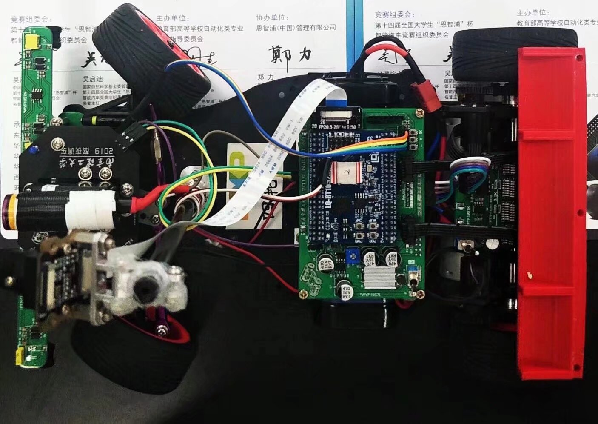

比赛视频

<video controls style="margin: 0 auto;" width="480">
  <source src="./videos/2019-nxp-car.mp4" type="video/mp4">
</video>

比赛用车



## 0.介绍

2019 年 7 月分我参加了当年的恩智浦杯智能汽车竞赛，以前叫飞思卡尔杯，对于自动化专业来说，这个比赛还是挺重要的。当时我大三，这个比赛(项目)算是我的第一个完成度比较高的作品。我负责的内容，硬件开发，驱动开发，整个软件框架的开发。

这辆车也一直放在我身边，当时可能只是感兴趣觉得好玩，现在看起来这应该是我整个嵌入式开发生涯的起点。现在的我能给出更好地方案，更完整的设计，甚至更高效的代码结构。但是让我去评价当年的写这些代码的自己，我觉得做的已经不错了，这是一个项目总结，同时也是一个关于如何写出好代码的一些想法。

这个车的主控芯片为 NXP imx 的跨界处理器，使用 IAR 完成裸机开发。当时大量的参考了 NXP 官方的源码，虽然是裸机开发但是当时也通过 NXP 例程学习了不少东西，后面的内容我会详细写出来。

## 1.比赛要求，智能车工作原理

固定元素，实现智能车的自动运行。

- 赛道上出现的元素
  - 赛道对比度比较高，摄像头是一定需要的。此外赛道上还铺设了电磁引导线，通着交流电，也可以通过磁场定位。赛道上还有障碍物，是显眼的红色。
  - 需要摄像头，电磁传感器
  - 障碍物
- 底盘控制
  - 舵机
  - 两个直流电机

硬件上，要考虑电机、舵机驱动，电磁传感器模拟信号的处理，整车供电。

车辆控制上，需要考虑通过图像获得智能车相对于赛道的偏差，这部分内容由我的队友负责，通过偏差计算出舵机的控制量，这部分也由我的队友负责。相当于我搭建一个比较可靠的运动平台，并提供控制算法需要的原始数据，然后将控制算法的输出落实到执行机构如电机、舵机。

## 2.硬件方案设计

我已经有几年不做硬件不画板了，但是这个项目是我比较完整的软硬件都做的项目，这里一定要拿出来介绍一下。使用 Altium Designer 来开发。考虑整车的电源设计，驱动板设计，电磁传感器设计，MCU 控制板的设计。


这个车的硬件还是比较简单的，MCU 用的 BGA 封装芯片使用了核心板，底板引出传感器和控制接口，做好供电设计。此外电机驱动与集成的半桥驱动芯片，两个芯片组成一个 H 桥直流电机驱动电路。再就是电池传感器，赛道上的交流电频率是 20KHz，根据磁场频率选择合适的电感和电容组成一个 LC 电路，在磁场中电感两端就会有电压信号，然后做放大检波等处理输入到 ADC 接口即可。


## 3.软件总体方案设计

这里由于软件设计上的不完善，只能通过 main 函数主循环的实现来猜测当时的设计想法了

```c
int main(void)
{
  /* ---------------------      硬件初始化         -------------------------- */
  system_init();/* MCU初始化 */
  //car_direction_barrier_test();/* 单个功能测试函数位置 */
  lpuart1_init(115200);         /* 蓝牙发送串口启动 */
  key.init();                   /* 按键启动 */
  led.init();                   /* 指示灯启动 */
  NVIC_SetPriorityGrouping(2);  /* 2: 4个抢占优先级 4个子优先级*/
  oled.init();                   /* LCD启动 */
  //ExInt_Init();                 /* 中断启动 */
  adc.init();
  motor.init();         /* 车速PID控制初始化.包含ENC,PWM,PID参数初始化 */       
  img.init();                   /* 相机接口初始化 */
  delayms(200);                 /* 必要的延时，等待相机感光元件稳定 */
  //UI_debugsetting();
  pit_init(kPIT_Chnl_0, 10000);
  
  while(1)
  {
	  /* 10ms中断置位？  */
	  while (status.interrupt_10ms == 0)
	  {
        adc.refresh();      /* 更新赛道电磁引导线信息，adc_roadtype数据包更新 */
        adc.circle_check(); /* 圆环检测、偏差检测，转换为电磁引导模式 */
	  }
    
    key.barrier_check(); /* 路障检查 */
    /* 如果图像就绪，图像刷新，道路类型判断 */
    if(kStatus_Success == CAMERA_RECEIVER_GetFullBuffer(&cameraReceiver, &CameraBufferAddr))
    {
      img.refresh();            /* 更新图像和偏差等控制信息 */
      adc.error_check();        /* 电磁引导线偏差检查 */
    }
    
    car.direction_control();  /* 舵机打角更新 */
    car_speed_calculate();      /* 更新一次左右电机目标速度 */    
    
    /* 两个电机转速控制 */
    motor.pidcontrol(&motor_speed);
    
    status_indicator.light_road();    /* 状态灯指示更新 */
    status_indicator.oled_circle();   /* 屏幕显示更新 */
    
    char txt[16];
    sprintf(txt,"ENC2: %6d ",(int16_t)ENC_GetPositionValue(ENC2));
    LCD_P6x8Str(0,5,(uint8_t*)txt);   

    /* 中断复位 */
    status.interrupt_10ms = 0;
  }
}
```

我现在看这段代码已经看不大明白了，好在函数名起的还可以，丢给 chatgpt，他给我的回答

>这个代码的控制逻辑通过一个定时中断来驱动，周期性地采集传感器数据、进行路障检测、图像处理和车辆控制。主循环确保每个任务在固定时间间隔内被执行，并根据传感器和相机的数据实时调整车辆的运动状态。

现在看来，主循环代码并没有做到不言自明，可以想到这个代码维护起来很困难，依靠四散在各处的全局变量来实现数据的传递。最主要的是在最上层的主函数并没有充分的体现出应用层的控制逻辑，一些函数的参数也莫名奇妙，比如 `motor.pidcontrol(&motor_speed);` 传入的参数没有前因后果。非常独立。

我现在评价这个代码：在形式上模仿了描述符(句柄 or 一个对象)控制一个对象的想法，但是只是参考了形式上的设计。并不知道为什么这么做。

## 4.关于一些驱动的讨论

摄像头的型号为 MT9V034，连接到芯片的 CSI 接口，这部分的代码使用了 nxp 官方的例程，里面大量的出现了类似的代码

```c
/*******************************************************************************
 * Variables
 ******************************************************************************/
const camera_receiver_operations_t csi_ops = {
    .init = CSI_ADAPTER_Init,
    .deinit = CSI_ADAPTER_Deinit,
    .start = CSI_ADAPTER_Start,
    .stop = CSI_ADAPTER_Stop,
    .submitEmptyBuffer = CSI_ADAPTER_SubmitEmptyBuffer,
    .getFullBuffer = CSI_ADAPTER_GetFullBuffer,
    .init_ext = CSI_ADAPTER_InitExt
};
```

不得不说，这些示例代码给了我对代码设计的良好启蒙。用我现在的理解来说，这些代码对设备对象和操作做了很好的封装，模块化的设计做的非常好，

我也做了形式上的模仿如 

```c
/* LED设备初始化 */
static void led_pin_init(void);

/* LED操作 */
static void led_on(led_name_t choose);
static void led_off(led_name_t choose);
static void led_reverse(led_name_t color);
static void led_flash_fast(led_name_t color);
static void led_flash_slow(led_name_t color);
static void led_off_all(void);

const led_operations_t led_ops = {
        .on = led_on,
        .off = led_off,
        .reverse = led_reverse,
        .flash_fast = led_flash_fast,
        .flash_slow = led_flash_slow,
        .off_a = led_off_all,
};

const led_device_t led = {
        .init = led_pin_init,
        .ops = &led_ops
};
```

具体的实现直接使用 nxp 的库。这也是我第一次学习使用这类语法，这对我后面学习 rt-thread 甚至 linux 都很有帮助。linux 内核中这类的表达也很多。

## 5.关于算法上的实现

目标是运动控制。那么有方法上的东西。用编程去实现理论的东西，应用控制算法。

智能车最主要的是靠摄像头的图像来运行。通过图像计算出车辆在赛道的偏差然后控制舵机转向。一些当时调试的照片

高斯滤波


赛道图像滤波、二值化，找中线


现在我觉得是我拖了队友的后腿。😂，因为方法都是用 matlab 仿真过的，现在的我看这些控制方法找不出一点毛病，但是看软件实现漏洞百出。事实上，从视频也可以看出来方法在当时就已经有了不错的控制效果。

到这一步以后，其实就可以做比较简单的方向控制了。为了对车做更精确的控制，也可以再进一步，相机视角是固定的，可以做一个逆透视。

采集照片和数学计算


实际采集到的照片和透视效果：


在 matlab 上验证过方法没问题后，将其在车上实现

```c
/* 逆透视变换矩阵 */
const double N1[8] = { -0.0649852534450704,2.53734549914701,-240.905004855923,1.72242380270896,-0.115684719493100,423.076434304688,0.130208451031495,-0.00342074612370382 };
const double N2[8] = { -0.0108680223123130,1.74103387838086,-172.804762452853,1.48135911232730,-0.324225542774878,294.738452846723,0.0903126321121198,-0.00636880777526755 };
const double N3[8] = { -0.0649852534450704,2.53734549914701,-240.905004855923,1.72242380270896,-0.115684719493100,423.076434304688,0.130208451031495,-0.00342074612370382 };

/* 坐标变换函数：像素坐标->实际坐标 */
static point_t img_locaion_transform(uint16_t pix_i, uint16_t pix_j) //坐标变换函数，输入行&列，返回结构体
{
	point_t real_coordinate;
	if (pix_i < 50)
	{
		real_coordinate.x = (N3[0] * pix_i + N3[1] * pix_j + N3[2]) / (N3[6] * pix_i + N3[7] * pix_j + 1) + 0.9;
		real_coordinate.y = (N3[3] * pix_i + N3[4] * pix_j + N3[5]) / (N3[6] * pix_i + N3[7] * pix_j + 1);
	}
	else if (pix_i > 70)
	{
		real_coordinate.x = (N1[0] * pix_i + N1[1] * pix_j + N1[2]) / (N1[6] * pix_i + N1[7] * pix_j + 1) + 0.9;
		real_coordinate.y = (N1[3] * pix_i + N1[4] * pix_j + N1[5]) / (N1[6] * pix_i + N1[7] * pix_j + 1);
	}
	else
	{
		real_coordinate.x = (N2[0] * pix_i + N2[1] * pix_j + N2[2]) / (N2[6] * pix_i + N2[7] * pix_j + 1) + 0.9;
		real_coordinate.y = (N2[3] * pix_i + N2[4] * pix_j + N2[5]) / (N2[6] * pix_i + N2[7] * pix_j + 1);
	}
	return real_coordinate;
}

/* 三点（实际坐标）算曲率 */
static double _img_curvature(point_t A, point_t B, point_t C)
{
  /* 三边长和三角形面积 */
	double AB, BC, AC, S;
	AB = distance(A, B);
	AC = distance(A, C);
	BC = distance(B, C);
	S = fabs((B.x - A.x)*(C.y - A.y) - (C.x - A.x)*(B.y - A.y)) / 2;  //三点构成的三角形面积
	return (4 * S / (AB*BC*AC));
}

/* 赛道半径计算函数，返回单位cm */
static double _img_calculate_r(void)
{
  /* 三点算曲率 */
	point_t A, B, C;
  /* 边线数组指针 */
  int16_t *p_line;    
  /* 左弯曲率用右边算 */
  if (status.img_roadtype == RoadLeft)
    p_line = rightline;
  /* 右弯曲率用左边算 */
  else if (status.img_roadtype == RoadRight)
    p_line = leftline;
  else  /* 程序出错。直路不进入此函数 */
    return 0;
  
  /* 像素位置逆透视为实际位置，这三行位置可以改变 */
	A = img_locaion_transform(70, p_line[70]);
	B = img_locaion_transform(60, p_line[60]);
	C = img_locaion_transform(50, p_line[50]);  

	/* 半径 = 1/曲率 */
  return (1/_img_curvature(A, B, C));
}
```

即通过图像直接计算弯道的半径，然后根据转弯半径可以做更精确的控制，甚至可以做实验直接找到需要的舵机转角值。


## 6.总结

分析这个比赛，从视频效果来看其实很不错，不足点还是出现在了软件架构的设计上。对于赛题的要求，实际上还有一个红色障碍物，还需要进圆环，还需要在跑完一整圈以后自动停车。这些都是业务上的逻辑，按道理是我应该负责的，当时的代码只完成了最基本的沿着赛道跑的逻辑，然后在检测不到赛道以后切换电磁控制逻辑。电磁导航的算法也是我做的。问题在于当时还没能有一套好的软件框架，如使用 RTOS 多线程开发，或是使用状态完成运行逻辑。整个业务逻辑属于是扶着脑袋硬想出来的，前后台的软件结构硬靠好多全局标志变量完成了这个事情。所以其实拿到华东二等奖也是一个合理的结果。

nxp 官方库的源码有很多封装、集成的面向对象的设计实现，形式上的模仿也让我收获了不少，后面再去学习 rt-thread 源码、甚至是 linux 一些驱动源码时，都能找到一些官方库的影子。


