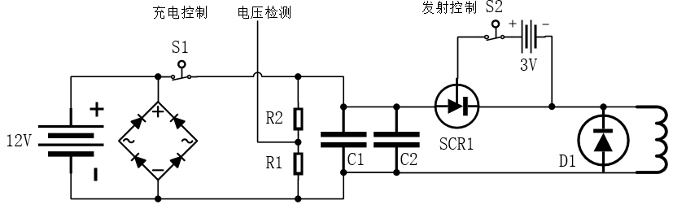

# 0.简介

我参加了 2019 年全国大学生电子设计竞赛，当时我大三。选的题目是模拟电池曲射炮设计。

赛题要求是设计制作一个电磁炮模型，通过视觉识别指定元素，自动发射射击。


需要实现的功能
- 炮弹的发射和命中功能
  - 最基本的发射功能
  - 对发射距离的控制
- 有视觉检测功能
- 炮管左右运动的功能

这个东西应该是硬件设计的内容占了60%，需要设计出合适的发射装置，使得可以通过  MCU 控制发射距离。视觉检测目标然后和转动到目标角度都要在能成功发射并命中的前提下才有意义。

先看当时实现的效果


精度还是不错的，拿了江苏省一等奖，实际上我们已经进入全国总测评了，如果总测评过了就是全国一等奖，没过是国二。但是呢，作品可能在路上出问题了，然后就退回省一了😂。还是比较可惜的，好在学校的比赛出问题都是小问题，如果这是工作上的失误那可能要出大问题。

23 年，有人觉得这个东西挺好玩的，是一个不错的教学用具，然后我在比赛的基础上，重新基于 RTOS 写了代码，并且做的更细致了一些


## 1.2019电赛版电磁炮的设计思路

实现赛题要求需要 3 部分，充能与发射装置、云台、视觉检测，当时主控芯片选的是 NXP imx rt1052，此外还有显示屏、按键等完成交互操作。

和电机控制类似，这也是个典型的低压控制高压的电子系统。先考虑充能和发射装置。

发射的基本原理，电感线圈流过电流时产生一个磁场，用磁场对磁性炮弹有一个作用力，完成对炮弹的发射。

这个感生磁场还不能一直存在，否则前段加速炮弹，后段会阻碍炮弹。也就是说线圈要通过瞬间的大电流，因此就需要大容量的电容来对线圈放电，刚好能实现比较好的发射效果。

此外还需要配套的充电装置和放电开关，还需要实时检测电容充电电压以控制电容中的储能量，这是对炮弹发射距离控制的关键。

由于比赛时使用的是锂电池供电，因此为了能给电容充电到一个比较高的电压，需要逆变器和整流器，对于充电通断的控制可以使用继电器来实现。

电容电压检测则需要使用分压电阻分压然后做隔离送入 MCU 的 ADC 端口

电容对发射线圈的放电开关需要使用晶闸管，使用继电器的话触点常容易损坏。

因此把发射模块看做一个整体，有这些输入输出引脚输出接口
- GPIO_IN, 充电控制
- GPIO_IN, 发射控制
- AD_OUT, 充电电压反馈



云台使用舵机云台就可以，这个让任务里，openmv 就可以胜任识别的工作，openmv 和 控制板 使用串口通信，openmv 只需要发送回目标的横坐标即可。

当时的代码是裸机开发实现的，代码也没做备份现在也找不到了😂。

## 2.教具版电磁炮的设计思路

发射部分、视觉识别部分、云台部分还是和以前一样，但是主控换成了 STM32，并且使用 rt-thread 来完成所有功能的开发，在交互功能上做了新的改进。

先来看效果


考虑到这是教学用具，设计这些功能
- 有两种模式：手动控制模式和自动追踪目标模式
- 手动控制模式使用按键调整炮管的指向
- 自动追踪模式下炮管自动指向目标
- 出于安全考虑不论是手动模式还是自动模式，都需要手动控制电容充电和发射
- 需要设计充满电自动停止充电的功能，并且需要使用蜂鸣器提示电容有点

因此这一版电磁炮使用了更多的控制按键，这就需要考虑按键的读取逻辑和按键处理事件这两个事情。比较复杂的系统，按键的读取与事件处理可以分离开来考虑，以提高代码的可维护性和扩展性。

rtt 提供了许多按键相关的软件包。使用事件驱动型按键驱动模块，将按键处理函数和按键及按键状态分开，去掉了按键处理的硬编码，使得业务逻辑更清晰。

比如控制云台转动的其中一个按键，定义按键，实现按键值读取函数和按键发生时要做的事情。

```c
Button_t btn_servo_l;

uint8_t read_btn_servo_l(void)
{
    return rt_pin_read(SERVO_L_PIN);
}

void btn_servo_l_down_cb(void *btn)
{
    status.pts_control = LEFT;
    rt_kprintf("SERVO_L_PIN once press\n");
}
```

然后在初始化时，绑定按键和事件触发的回调函数。

```c
Button_Create("btn_servo_l", &btn_servo_l, read_btn_servo_l, PIN_LOW);
Button_Attach(&btn_servo_l, BUTTON_DOWM, btn_servo_l_down_cb);
```

然后开一个线程调用库作者提供的按键处理函数即可。用户只需要思考按键按下以后，有什么事情要发生即可。

## 3.总结

这已经是我时隔多年总结以前的项目，这个项目是我刚使用 rt-thread 比较熟练的时候做的，但是现在会看以前的代码，其实还是有很多问题。

比如按键逻辑的那一块，即使使用了按键库，我还是定义了一个 `int key=0` ，在按键回调函数中修改了这个值，现在已经看不懂为什么要改值了，拿我现在对自己的标准来说，这个代码没有做到不言自明，用数字代表状态本来就增加了阅读代码的障碍，这使得用了按键库也并没有比没用让代码更好读。

如果现在让我实现这个代码的话，我大概率会直接在按键回调函数中去修改云台对应方向的转角值。因为操作的逻辑就是按下左键，云台左移，那么回调函数里就直接做左移的动作。这样的代码应该才是**不言自明**的。完全把操作逻辑和代码逻辑就对应起来了。


