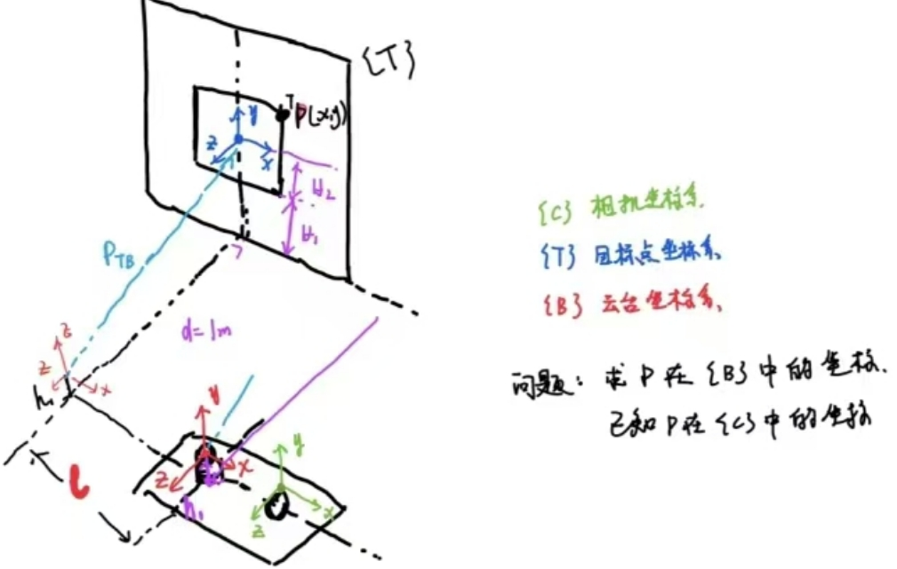
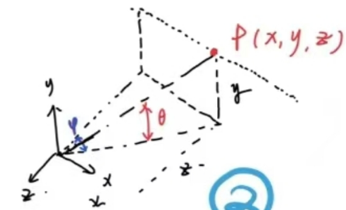
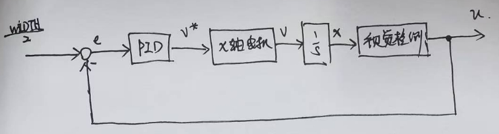

## 0.简介

来源于 2023 年大学生电子设计竞赛的题目。导师正好是电赛的指导老师，我参加过2019年电赛，然后就帮忙一起指导一下。

出方案，方法验证，分工。

设计制作一个运动目标控制与自动追踪系统。


需要做两套系统，两套系统之间无通信
- 位置控制系统，红色激光模拟目标运动，激光点画出指定的矩形
- 自动追踪系统，绿色激光用来指示，绿色激光点跟踪红色激光运动

自动追踪系统只在完成提高题时需要。

## 1.赛题分析与方案设计

根据题目，有这几个比较重要的需要实现的功能
- 1.红色激光点能做一个固定大小的矩形运动
- 2.黑色胶带贴一个矩形框，红色激光点可以沿着黑框运行
- 3.绿色激光点追踪红色激光点运行

第 1 点，基础题的要求，激光点可以跟着铅笔线画一个方框。可以肯定的是铅笔线肯定不是用来做图像识别的，而且位置控制系统和屏幕的摆放都有严格的距离要求，那么在红激光点的位置上不需要做闭环控制，根据几何参数做计算，找到屏幕坐标系中点的位置和云台两个电机转角的关系，直接开环运动即可。需要在硬件上下点功夫，精度严重依赖几何参数，可以直接做一个架子，云台和屏幕都固定死了，😂，这种应试的项目不要不违反要求都是能做的。此功能要实现的代码的功能
- 实现指定两点之间的直线运动

第 2 点，黑胶带显然是要做视觉识别的，矩形运动比较关键的位置是 4 个顶点。有了 4 个点其实就可以计算出矩形边上所有的点了。这个目标的思路，一个也是纯开环控制，和功能 1 一样 ，有了四个点以后，有没有黑框就不重要了。
- 需要一个能给我发送矩形 4 个点的传感器(矩形 4 点传感器)
    - 具体是 openmv 、linux 板用 opencv 不重要
    - 只要能按顺序发来 ABCD 在屏幕上的坐标位置就行

第 3 点，位置控制系统(红色激光)不需要大的功能上的改动了。考虑目标追踪系统该如何设计。可以肯定的是要做一个位置上的闭环控制，目标点是红色激光的位置，一个容易想到的思路是识别绿色激光点的位置，这就就有了两个点的位置误差。但是这样的话要在一块板上同时处理红绿两个点实现起来可能要花点时间。我的思路：直接将摄像头固定到云台上，控制目标是将红色激光点保持在视野中央，有没有绿激光点不重要，绿激光只是给人看的指示云台指向位置的一个挂件。可以吧绿色激光调到足够暗，人勉强看到就好了，😂，应试项目，所有的处理都是符合规则的。这样的话为视觉识别那一块的要求就不高了。甚至如果是闭环控制的话，不需要红激光点在屏幕上的真实坐标，像素坐标位置就可以了
- 需要一个固定在云台上的激光点位置传感器
    - 同样用什么方法实现、什么设备实现的不重要
    - 只要能发回来红色激光点的像素坐标 (x,y) 就行

那么设计方案就出来了。两个系统都分为运动控制部分 + 视觉检测部分，两个部分相对独立，可以使用串口来完成通信。

云台使用伺服电机，可以接收位置控制指令或速度控制指令，使用 MCU 实现运动控制。

位置控制系统(红色激光点)的摄像头不需要安装在云台，但是相对于屏幕的位置要固定，视觉检测部分和运动控制部分的通信内容：矩形 ABCD 四个顶点在屏幕上的坐标。

```c
point_t rectangle[4];
```

目标追踪系统的摄像头要安装到云台上，视觉检测部分和运动控制部分的通信内容：红色激光点的像素坐标 
```c
pix_t red_point_pix;
```
通过串口发送时，加上帧头帧尾和校验字节，方便解析、防止传输出错。

电赛三人小队可分工一人负责控制部分，另一人负责图像处理部分，各自对接通信协议即可。

相对来说，位置控制系统的视觉检测部分需要处理的东西会多一些，可以使用 linux 开发板跑调 OpenCV 库，跟踪系统的视觉检测部分只需要识别一个激光点，OpenMV 也可以胜任。

原理上是可行的，还有一些结构或硬件上小细节的设计，方便软件的设计
- 红激光点在符合规则的情况下尽量的大，光晕也大一些
- 绿激光点是给人看的，勉强能看到就行，减小对图像算法的影响
- 结构上的设计，激光安装在云台两个轴的交点处，方便坐标转换的计算

## 2.控制方法与仿真

### 功能 1 和功能 2 的控制方法

功能 1 和功能 2 在控制上没有区别，只不过功能 1 的跟踪矩形的 4 个点是写死在程序里的，功能 2 的矩形点是视觉检测部分通过串口发来的。

这里以功能 1 为例。只展示控制部分的想法和控制算法的代码。

开环控制的思路：

云台有俯仰角 $ \theta $ 和偏转角 $ \varphi $，用一个向量表示云台的转角 $ \Theta = [\theta, \varphi] ^T $。任意两个角度都对应了屏幕上的一个点 $ P = [x, y] ^T $，考虑云台的角度范围限制，也即 $ P = g(\Theta) $。那么凭着原始朴素的直观感觉不加证明的下一个结论：每个一个屏幕上的点 $ P $，一定可以找到唯一一个对应的云台转角 $ \Theta $，在云台允许的范围内这是个一一映射，即找一个函数 $ f = g^{-1} $ ，使得

$$ 
\Theta = f(P)
$$

然后只有有一个 $ P $，就可以计算出 $ \Theta $ 发送给云台的两个伺服电机。

这样屏幕上的每个点就都能到了，两点确定一条直线，画一条线只需要首两个点就行，在两个点之间插入足够多的点，按顺序发送每个点的转角指令看起来就实现直线运行效果了。

接下来就是找出这个函数 $ f $。



首先用一个数学问题的方式来描述，云台和屏幕的几何位置关系如图。$ {T} $ 为屏幕坐标系，$ {B} $ 为云台坐标系。

一个点的像素坐标为 $ (u,v) $，通过相机和合理安装，用比较简单的方式可以得到像素坐标上的点在屏幕坐标的位置

$$ ^T P = T_1 \cdot [u, v]^T $$

有了屏幕坐标系上点的坐标 去计算云台坐标系里的坐标

$$ ^B P =  {^B_T T} \cdot \ ^T P $$

最后根据 $ ^B P $ 用一些三角函数计算就能算出需要的角度了。

T 到 B 的变换是一个比较简单的齐次变换，不需要考虑旋转，只有平移，比较容易写出

$$
^B_T T =  
\left [
    \begin{array}{}
        I & p_{TB} \\\\
        0   & 1   \\\\
    \end{array}
\right ] = 
\left [
    \begin{array}{}
        1 & 0 & 0 & -l \\\\
        0 & 1 & 0 & H_1 + H_2 - h_1 \\\\
        0 & 0 & 1 & -d \\\\
        0 & 0 & 0 & 1   \\\\     
    \end{array}
\right ]
$$

也即 

$$
\ ^B P = \ ^B_T T  \ ^T P =  
\left [
    \begin{array}{}
        1 & 0 & 0 & -l \\\\
        0 & 1 & 0 & H_1 + H_2 - h_1 \\\\
        0 & 0 & 1 & -d \\\\
        0 & 0 & 0 & 1   \\\\
    \end{array}
\right ]
\left [
    \begin{array}{}
        ^T x  \\\\
        ^T y  \\\\
        0 \\\\
        1 \\\\
    \end{array}
\right ]
$$

就能计算出出屏幕上用 T 坐标系表示的点在云台上 B 坐标系的坐标值了。(其实对于这个比较简单的关系，硬看也能看出来下面的结论，但是齐次坐标变换是一种解决这类问题的通用思路)

$$
\left \{
    \begin{array}{l}
        ^B x = \ ^T x  - l \\\\
        ^B y = \ ^T y + H_1 + H_2 - h_1 \\\\
        ^B z = -d \\\\     
    \end{array}
\right .
$$

一个细节，激光笔安装的时候要位于云台两个轴的交点上，这样电机的转角直接就是激光束的转角，这个坐标系x轴和俯仰转轴重合，y轴和左右转轴重合，如下图



此时有了上面的 $ ( ^B x, \ ^B y, \ ^B z) $ 就能计算两个角了。

由三角函数关系

$$
\tan \theta = \frac{y}{\sqrt{ x^2 + y^2 }}
$$

$$
\cos \varphi = \frac{z}{\sqrt{ x^2 + z^2 }}
$$

就能计算出 

$$
\theta = \arctan \frac{y}{\sqrt{ x^2 + y^2 }}
$$

$$
\varphi = \arccos \frac{z}{\sqrt{ x^2 + z^2 }}
$$

至此实现了把点的像素坐标转换到两个电机转角。

然后就是处理走直线的问题，这个也很简单，给出 2 个点 $ A(x_A, y_A) $ 和 $ B(x_B, y_B) $，求解的参数坐标表示，然后从 A 点开始控制参数，使得一点点向 B 点运动。

### 功能 1 和 2 仿真

先看效果

<video controls style="margin: 0 auto;" width="480">
  <source src="./videos/laser-track-1.mp4" type="video/mp4">
</video>

有了前面的理论，接下来就是用代码实现了，这里我使用了 webots 仿真，由于控制算法由 MCU 来实现，因此我使用 C 语言实现了仿真的控制算法。

一个点定义为 

```c
typedef struct
{
    double x;
    double y;
    double z;
}
point_t;
```

通过串口收到的为屏幕坐标下的矩形的 4 个坐标点，因此需要按照上述思路做变换，就按照上面的流程实现 T 到 B 和 B 到 角度的变换函数

```c
void T_to_B(point_t* in, point_t* out)
{
    out->y = in->y + H1 + H2 - h1;
    out->z = -d;
}

void B_to_angle(point_t* in, ptz_t *out)
{
    double yaw, pit;
    double a = sqrt(in->x * in->x + in->z * in->z);
    
    yaw = acos(-in->z / a);
    pit = atan(in->y / a);

    /* 数学计算上的符号处理 */
    if (in->x < 0)
        out->yaw = -yaw;
    else
        out->yaw = yaw;

    out->pit = pit;
}
```

有些常数使用宏定义，参考完整源码。

有了坐标变换，就可以直接实现一个从 A 运动到 B 的函数了
```c
/* 从A点移动到B点，times为中间插入的目标点个数 */
void move(point_t A, point_t B, int times)
{
    point_t target;

    double x_length = B.x - A.x;
    double y_length = B.y - A.y;

    for (int i = 0; i <= times; i++)
    {
        target.x = ((double)i / times) * x_length + A.x;
        target.y = ((double)i / times) * y_length + A.y;

        T_to_B(&target, &target);
        B_to_angle(&target);

        ptz_set(target);

        /* 延时等待转到位 */
        wait(1);

        //output(target);
    }
}
```

这里的 `ptz_set` 传入的参数会直接发送给伺服电机运行。这里的运行函数还有个参数数 times，这个参数是我设计用来控制两点之间的插入点个数的，传入的参数是屏幕坐标系下的坐标值。

ptz_set 函数的实现依赖于实际硬件，在 webots 里，我是这样实现的

```c
#include "device.h"

/* motor init */
WbDeviceTag motor_yaw, motor_pit;

void motor_init(void)
{
    motor_yaw = wb_robot_get_device("motor_yaw");
    motor_pit = wb_robot_get_device("motor_pit");
}

/* 以弧度值设置云台转角，p.x 为偏转角，p.y 为俯仰角 */
void ptz_set(ptz_t ptz)
{
    wb_motor_set_position(motor_yaw, ptz.yaw);
    wb_motor_set_position(motor_pit, ptz.pit);
}

void device_init(void)
{
    wb_robot_init();
    motor_init();
}
```
这部分参考 webots 的手册，通过名称获得电机的描述符，然后就可以通过描述符以及 webots 提供的 api 向仿真环境的电机发送指令了。

那么完成功能的实现也就有思路了，节选主函数的代码

```c
    /* 画外框 坐标值为{T}坐标系，可用串口接收 */
    point_t recive[4] = {
        [0] = {-0.25,0.25,0.0},
        [1] = {0.25,0.25,0.0},
        [2] = {0.25,-0.25,0.0},
        [3] = {-0.25,-0.25,0.0},
    };
    move(recive[0], recive[1], 300);
    move(recive[1], recive[2], 300);
    move(recive[2], recive[3], 300);
    move(recive[3], recive[0], 300);

    /* 暂停 */
    while (wb_robot_step(TIME_STEP) != -1)
    {
    }
```

这里直接写死了 4 个点，然后调用画线函数即可。

如果看这段程序的源码，前面还有一些移动到中心点的操作，总的思路都是由屏幕左边计算出两个电机转角，然后向电机发送指令，如

```c
    /*------  移动到中点  --------*/
    /*  坐标值为 {T} 参考系 */ 
    point_t point =
    {
        .x = 0,
        .y = 0,
        .z = 0,
    };

    T_to_B(&point, &point);
    B_to_angle(&point, &ptz_output);

    ptz_set(ptz_output);

    /* 等待执行到位 */
    wait(100);
```

要注意的是，由于是开环控制，这里要给电机足够的响应时间。

实现功能的方法上的核心代码就是这样，还需要根据赛题去基于此实现更多的功能，如按键暂停、按键恢复，以及串口接收 4 个点的坐标的逻辑等。


### 功能 3 的控制方法

这是一个二维平面的位置跟踪控制，按照我的思路，控制目标是红色激光点保持在画面中央。这是一个闭环控制系统，不加证明的凭朴素的直观想法给出结论：x，y 两个轴可以分开独立考虑。只考虑 x 方向的控制框图为



摄像头排到的画面长宽为 (WIDTH, HEIGHT)，控制目标是保持在画面中央。控制器的输出为对应轴的电机速度的给定值，伺服电机在速度控制模式下，积分后就是位移，然后经过视觉部分就是像素坐标值。大概就是这么个思路。

这部分视觉检测部分通过串口发送红色光电的像素坐标值即可。控制器其实就比例控制器就行。


### 功能 3 仿真

还是先用 webots 仿真实现一下。先看效果

<video controls style="margin: 0 auto;" width="480">
  <source src="./videos/laser-track-2.mp4" type="video/mp4">
</video>

<video controls style="margin: 0 auto;" width="480">
  <source src="./videos/laser-track-3.mp4" type="video/mp4">
</video>


webots 里也有相机，还需要自己实现一个找红色激光点的算法，仿真环境这块很好处理：
```c
void find_red_point(void)
{
    const unsigned char* image = wb_camera_get_image(camera);

    for (int x = 0; x < IMAGE_WIDTH; x++)
    {
        for (int y = 0; y < IMAGE_HEIGH; y++)
        {
            int r = wb_camera_image_get_red(image, IMAGE_WIDTH, x, y);

            if (r > 200)
            {
                pix.u = x;
                pix.v = y;

                return;
            }
        }
    }
}
```
直接看 r 通道的值就行，😂，毕竟是仿真。

实际的代码也非常简单

```c
while (wb_robot_step(TIME_STEP) != -1)
{
    find_red_point();

    double yaw_v = -0.05 * (IMAGE_WIDTH / 2 - (pix.u + 1));
    double pit_v = 0.05 * (IMAGE_HEIGH / 2 - (pix.v - 4));

    ptz_set_velocity(yaw_v,pit_v);

}
```

找红点找的是第一个符合的像素，这里加了一点点小修正，然后可以看出就是个最简单的比例控制。

`ptz_set_velocity` 需要根据实际硬件实现。webots 里和位置控制差不多，这里就不放出来了。


## 4.实物实验

功能 1 和 2 依赖结构上的参数，我没做实物😂，我只做了功能 3 验证控制算法是否可行，做了一个云台，使用 OpenMV 做激光点的识别，然后手持激光笔做测试。

先看效果

<video controls style="margin: 0 auto;" width="480">
  <source src="./videos/laser-track-4.mp4" type="video/mp4">
</video>

OpenMV 中看到的视角

<video controls style="margin: 0 auto;" width="480">
  <source src="./videos/laser-track-5.mp4" type="video/mp4">
</video>


关于硬件，云台自制，使用 CAN 总线控制的电机，MCU 开发板选用大疆的 Robomaster A 板，芯片型号为 STM32F429。

关于 OpenMV：OpenMV Cam是一个可编程的摄像头本身内置了一些图像处理算法，很容易使用。处理芯片为 STM32 H7，简单易用方便快捷，我本身并不做图像处理，对这一块也不熟悉，但是 openmv 也可以比较快的用起来。

### 运动控制部分

这部分使用 STM32 实现，基于我熟悉的 rt-thread 开发，不考虑电赛的逻辑，只考虑激光追踪功能本身。除了算法，需要实现的和硬件相关的功能：
- 伺服电机的 CAN 通信，实现速度控制的接口
- 与 openmv 的通信，接收红色激光点的像素坐标值

这里使用 rtt 实现的 CAN 驱动来完成和电机的通信，

两个伺服电机接在一个 CAN 总线上，代码实现

```c
static void can_tx_thread_entry(void *parameter)
{
    struct rt_can_msg msg = {0};
    rt_size_t   size;               /* 接收发送状态 */
    
	rt_int32_t speedControl;

    /* 速度帧设置 */
    msg.ide = RT_CAN_STDID;         /* 标准格式 */
    msg.rtr = RT_CAN_DTR;           /* 数据帧 */
    msg.len = 8;                    /* 数据长度为 8 */
	
	/* 转矩控制的固定数据位 msg.data[4][5] 转矩位 */
	msg.data[0] = 0xA2;             /* 操作码 */
	 
	msg.data[1] = 0x00;
	msg.data[2] = 0x00; 
	msg.data[3] = 0x00;
	
    while(1)
    {
		speedControl = motor.pit.control.speed;

		msg.id   = 0x142;	
		msg.data[4] = *(rt_uint8_t *)(&speedControl);
		msg.data[5] = *((rt_uint8_t *)(&speedControl)+1);
        msg.data[6] = *((rt_uint8_t *)(&speedControl)+2);
        msg.data[7] = *((rt_uint8_t *)(&speedControl)+3);
		
		size = rt_device_write(can_dev, 0, &msg, sizeof(msg));

        RT_UNUSED(size);
		
		rt_thread_mdelay(5);
		
		speedControl = motor.yaw.control.speed;
	
		msg.id      = 0x141;
		msg.data[4] = *(rt_uint8_t *)(&speedControl);
		msg.data[5] = *((rt_uint8_t *)(&speedControl)+1);
        msg.data[6] = *((rt_uint8_t *)(&speedControl)+2);
        msg.data[7] = *((rt_uint8_t *)(&speedControl)+3);
		
		size = rt_device_write(can_dev, 0, &msg, sizeof(msg));
		
        rt_thread_mdelay(5);
    }
}
```

motor.yaw.control.speed 位全局变量，控制器直接写这个值即可。

与 openmv 的通信为 UART 接口，使用 rtt 提供的驱动来通信，串口消息接收使用 DMA + 串口空闲中断的方式。使用 rtt 提供的**消息队列机制**来实现串口接收中断回调函数和接收数据处理线程的同步。当一批数据接收完成，进入接收中断回调函数中发送一个消息。数据处理线程阻塞等待接收消息队列中的消息。写入 `pix_t pix` 全局变量。

数据处理线程
```c
static void openmv_thread_entry(void *parameter)
{
    struct rx_msg msg;
    rt_err_t result;
    rt_uint32_t rx_length;
	
    rt_uint8_t rx_buffer[RT_SERIAL_RB_BUFSZ + 1];
    rt_uint8_t* byte = rx_buffer;                   /* 缓冲区别名 */
    
    rt_uint8_t data_count = 0;
    
    while (1)
    {
        rt_memset(&msg, 0, sizeof(msg));
        
        /* 从消息队列中读取消息*/
        result = rt_mq_recv(&rx_mq, &msg, sizeof(msg), RT_WAITING_FOREVER);
        if (result == RT_EOK)
        {
            /* 从串口读取数据*/
            rx_length = rt_device_read(msg.dev, 0, &rx_buffer[data_count], msg.size);

			data_count = data_count + rx_length;
                        
            /* 可以使用状态机解包 */
            if (byte[0] == 0x55 && byte[1]==0x55 && byte[4]==0xAA)
            {
                /* 满足帧头才判断帧长 */
                if (data_count >= 5) 
                {
                    pix.u = byte[2];
                    pix.v = byte[3];
                    					
                    /* 准备下一数据帧接收 */
                    data_count = 0;
                }
            }
            else /*帧头不对，重新接收等待帧头*/
            {
                data_count = 0;
            }
        }
    }
}
```
由此可以看出通信协议的格式为

55 55 pix.u pix.v AA

Openmv 图像的长宽都小于 255，因此用一个字节就可以了。

最重要的运动控制线程
```c
static void motion_thread_entry(void *parameter)
{
    /* 偏转控制器 */
    controller_t yaw_controller;
    controller_set_pid_parameter(&yaw_controller, 120, 0, 0);
    controller_set_output_limit(&yaw_controller, 5000);
    
    /* 俯仰控制器 */
    controller_t pit_controller;
    controller_set_pid_parameter(&pit_controller, 120, 0, 0);
    controller_set_output_limit(&pit_controller, 5000);
	
    while (1)
    {
        /* 自动控制 */
        /* 这里的数字时偏转角和俯仰角的目标值，为像素坐标 */
        motor.yaw.control.speed = controller_output(&yaw_controller, 180, pix.u);
        motor.pit.control.speed = -controller_output(&pit_controller, 180, pix.v);

		rt_thread_mdelay(25);
    }	
}
```

这里我自己写了一个通用的 PID 控制器，但是只给了比例系数为 120，并且做了控制器的输出限幅。

PID 控制器的实现 
```c
double controller_output(controller_t *controller, double ref, double feedback)
{
    controller->feedback = feedback;
    controller->ref = ref;

    controller->err = controller->ref - controller->feedback;

    /* 积分分离，误差过大不积分 */
    if (controller->err > controller->int_boundary || controller->err < -controller->int_boundary)
    {
        controller->err_sum = 0;
    }
    else
    {
        controller->err_sum += controller->err;
    }
	
	/* 误差低通滤波 */
	controller->err_lpf = controller->err_lpf1 + LPF_alpha*(controller->err - controller->err_lpf1);
	
	/* pid 控制器输出 */
    controller->output = controller->kp * controller->err + \
                         controller->ki * controller->err_sum + \
                         controller->kd * (controller->err - controller->err1);

    controller->err1 = controller->err;
	controller->err_lpf1 = controller->err_lpf;

    /* 输出限幅 */
    if (controller->out_lim > 1e-8)	/* 输出限幅值不为0 */
    {
        if (controller->output > controller->out_lim)
            controller->output = controller->out_lim;
        if (controller->output < -controller->out_lim)
            controller->output = -controller->out_lim;
    }

    return controller->output;
}
```

这里还考虑了误差的低通滤波，使用位置式 PID 控制器实现。

### 视觉检测部分

这部分比较简单，细节参考 openmv 的手册

```c
import sensor, image, time, pyb

sensor.reset()
sensor.set_pixformat(sensor.RGB565)
sensor.set_framesize(sensor.QVGA)
sensor.set_windowing((180, 180))
sensor.skip_frames(time = 2000)
sensor.set_auto_gain(False)
sensor.set_auto_whitebal(False)

clock = time.clock()                # Create a clock object to track the FPS.

led     = pyb.LED(3)
uart    = pyb.UART(3,115200)

red_point = (24, 100, 14, 127, -128, 127)
# red_point = (30, 100, 20, 127, -128, 127)

while(True):
    clock.tick()                    # Update the FPS clock.
    img = sensor.snapshot()         # Take a picture and return the image.

    blobs = img.find_blobs([red_point])

    if blobs:
        for b in blobs:

            # 坐标旋转
            x = 179 - b.cy()
            y = b.cx()

            # 串口输出
            uart_output = "%c%c%c%c%c" % (0x55, 0x55, x, y, 0xAA)
            uart.write(uart_output)
    else:
        led.off()

        # 串口输出
        uart_output = "%c%c%c%c%c" % (0x55, 0x55, 90, 90, 0xAA)
        uart.write(uart_output)

    #print(clock.fps()) # 注意: 你的OpenMV连到电脑后帧率大概为原来的一半
```

总共不到 50 行代码，一些细节，摄像头是横着安装的，做了一个坐标的旋转变换。此外在没有找到激光点时，返回 90，90，即误差为0，效果是让云台停止运行。

## 6.总结

仿真的重要性，以及算法设计时对移植性的考虑。


