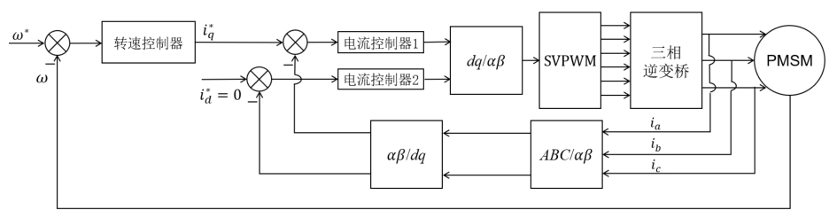

## 0.简介

学校项目，用于大负载转台驱动的伺服控制系统开发。要求能实现高精度的转角控制以及对制定目标的跟踪控制。

使用电机为 PMSM，功率 40 kW，$ U_{IN} = 396 $ ，$ I_{o(eff)} = 73 A $，极对数 4。

实验室有一套祖传的电机控制板和代码，使用了 DSP + CPLD 的方案。芯片型号
- DSP ：TMS320F28335
- CPLD ：AG256SL100

此外还有一个配套的 LabView 的上位机，用来调整控制参数。也即核心控制算法上面，没有什么我需要去实现的，拿来先用。我只需要实现功率部分，然后调试硬件，最后调试控制参数。

这个项目对我来说算是个硬件设计项目。

## 1.PMSM 控制原理与方法

TMS320F28335 这个芯片常用来做电机控制，我看的一些拆车视频中，比亚迪秦、特斯拉 model 3 的电机驱动器用的就是这个型号的芯片。ST 也有专门用来做电机控制的芯片，有些一体化电机用的是 STM32 的芯片，还有好多开源的电机控制学习板也是这款芯片。

这里简略的介绍下 PMSM 的 FOC 控制算法

FOC 的核心想法是将定子三相电流通过坐标变换到定子同步旋转坐标系，分解为励磁电流和转矩电流。由于使用的是 PMSM，转子为永磁体，故使用了 $ i_d^* = 0 $ 的控制策略。经过坐标变换后，PMSM 的控制方式就和直流电机类似，励磁电流和转矩电流解耦分别进行控制。

SVPWM 则是一种发波方法，能提高母线电压的利用率，其本质也是一种三次谐波注入的方式，其更容易使用微控制器实现。

更细节的方法上的内容可以参考我的[电机控制学习笔记](https://electronics.xym.work/6motor_control)。

## 2.功率部分设计

方法是这么个方法，从实现上来讲，MCU 需要的需要采集三相电流，转子位置，输出的 PWM 信号需要驱动功率模块。

一般的，低压部分和高压功率部分，低压部分实现纯逻辑的东西，高压功率部分即驱动板，完成信号的变换、隔离、功率输出。

此外实际的电机控制还需要考虑保护，比如过压、欠压、过流等功能。这些事情软件也可以做，但实际的电机控制一般都会用硬件实现以更快的实现保护，因此加了一个 FPGA ，在遇到硬件保护触发时，直接切断 PWM 输出，然后向微控制器发送错误代码。

STM32 的电机开发套件里给了更详细的图。

也可以看出电机控制这一块其实已经比较成熟了。

我要设计的是功率部分，先看实验室祖传的电机控制板的接口
- 通信接口
  - CAN 通信接口 2 路
  - RS485 通信接口 2 路
- 驱动部分接口
  - PWM输出 6 路
  - 相电流检测输入 2 路，(0-5V)
  - 母线电压检测输入 1 路，(0-5V)
  - 温度检测输入 1 路(0-5V)
- 转子位置传感器
  - 旋转变压器 1 路

DSP 控制板内部原理，简单画了个图

功率部分的硬件设计

整个系统的电源输入为 700V，经过一个DCDC模块转换为24V 给低压部分供电。

一些关键元件的选型
- IGBT FF600R17ME4 ，配套驱动 2SP0115T2A0C
  - 耐压 1600V，额定电流 600A，瞬时电流 1200A
- 电流传感器 HNC-500LT 霍尔电流传感器
- 母线电压检测 HNV025A

以及一些配套的电源模块，都选用了金升阳的。

小功率的电机驱动板会用 MOSFET ，电流传感器使用采样电阻，整个做成了一块板。这个大功率的每个元件都挺大，功率板和信号转接板的作用差不多。这里功率板的设计，我也画了个图

考虑到高压下调试时候一摊东西不是很安全，搞一个箱子装起来

## 3.控制箱

## 4.调试

## 5.总结

