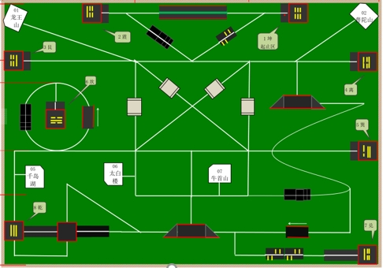
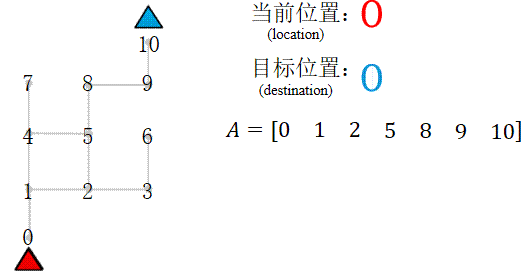
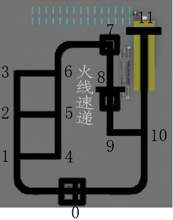
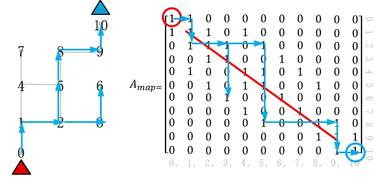
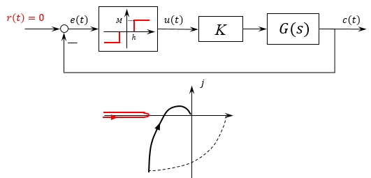

## 0.介绍

实习期间项目，实习公司卖教育机器人的套件，并且是比赛主办方，需要比赛配套的示例代码。实习之前我参加过一些比赛了，我做的第一个比赛就是循迹车，正好总结一下。

循迹类机器人比赛，使用灰度传感器识别色差比较明显的线，完成规定任务的比赛。我的整个嵌入式生涯、STM32 的第一个完整作品就是一辆循迹小车，去参加学校的机器人比赛。比赛要求是从指定的位置出发，然后沿着白线在规定的时间里去尽可能多的地方。



当时自己买了配件，画了底板，在宿舍搭了第一个车


就以这个比赛，分析一下如果想做好，控制上和代码上需要考虑的一些问题。

按照机器人开发的思路，分为路径、控制、定位、代码结构几个部分。

## 路径

考虑路径之前，先考虑怎么按照一个给定的路径走。

先用一个简化的图举例，给每个点都标上号，给出一个路径点序列，这就是一条要走的路。

对于这个比赛，需要知道车在哪里，下一点要去哪里。可以用状态来思考，一条路径的每个点都是一个状态，一个状态的下一个状态是确定的，然后根据当前状态，一步一步转移，最终到终点



先看一个按照这个思路设计的演示视频

<video controls style="margin: 0 auto;" width="480">
  <source src="./videos/tracking-robot-1.mp4" type="video/mp4">
</video>

程序上的一个大概得思路

```c
void auto_run(unsigned char location, unsigned char destination)
{
  if (destination > location)   /* 正向运行 */
  {
    for (int i = location + 1; i <= destination; i++)
    {
      auto_drive_fun_lst(i);
    }
  }

  else if (destination < location)   /* 反向运行 */
  {
    for (int i = location - 1; i >= destination; i--)
    {
      auto_reverse_fun_lst(i);
    }
  }
}
```

这里隐含了一些状态机的想法，其实如果直接用状态机的框架可能会更好一点。这里的逻辑还是有一点绕。

对于这个比赛的地图，使用了下面的标点



有 3 条路线

$$
A =  
\left [
    \begin{array}{}
        0 & 1 & 4 & 5 & 6 & 7 & 8 & 9 & 10 & 11 & 10 & 0 \\\\
    \end{array}
\right ] \tag{1}
$$

$$
A =  
\left [
    \begin{array}{}
        0 & 1 & 2 & 5 & 6 & 7 & 8 & 9 & 10 & 11 & 10 & 0 \\\\
    \end{array}
\right ] \tag{2}
$$

$$
A =  
\left [
    \begin{array}{}
        0 & 1 & 2 & 3 & 6 & 7 & 8 & 9 & 10 & 11 & 10 & 0 \\\\
    \end{array}
\right ] \tag{3}
$$

在程序中可以直接用硬编码路径，然后指定使用哪一个数组。

到这一步其实并没有涉及到真正意义上的机器人导航中路径规划的问题。为了让机器人更智能，可以硬编码地图，只给出发点和目标点，然后机器人自己去计算一条可行路径存放一个数组里。还是上面那个简单的地图，首先考虑如何表示这个地图，一个简单的想法：用一个矩阵来表示点的连通性，无向的话是一个对称矩阵



前面是硬编码了地图，再往前一步，如果说还想让这个机器人更智能，比如说能自己边跑边建立一个地图，然后吧地图保存下来。那么距离真正的智能又更近了一步。对于使用灰度传感器来说，建立地图也不是一件遥不可及的事情，但是所有的这些东西都依赖于巡线控制的效果，因为这类机器人想实现实时定位需要另外加传感器，如果紧靠灰度传感器，那么就会一步错、步步错。

## 控制

看一个麦克纳姆轮底盘灰度巡线的控制效果

<video controls style="margin: 0 auto;" width="240">
  <source src="./videos/tracking-robot-2.mp4" type="video/mp4">
</video>

从原理上来分析一下


当白线处于左侧灰度传感器外或右侧灰度传感器外时，相当于已经失控了，所以实际的传感器的函数表示为


这是一个典型的非线性系统，在自动控制原理书上可以找得到原题的那种。车的左右控制也是可以建模出来的，但是懒得推公式了，(通过实验现象反推)这个高阶系统可以用一个二阶系统来近似，那么这样的话，方向控制就是一个非线性章节的例题：



一眼看出方向控制系统是会有振荡的，自振周期以及幅值与控制系数 $ K $ 有关。

我特意调了两个不同的 K，这个系统也是程序里真实的值 

代码的实现 

```c
/* 循迹测试函数 */
void track_drive_test(void)
{
  while (1)
  {
    /* 20ms执行一次控制 */
    delay_ms(20);

    /* 车前进速度和差速值控制，error前的系数 */
//    motor_move(300, 1000 * gray_front_error());
    motor_move(300, 260 * gray_front_error());

    /* 遇到十字路口，停车，跳出控制循环 */
    if (gray_is_cross())
    {
      motor_move(0, 0);
      break;
    }
  }

  while (1);   /* 测试程序停在此处 */
}
```

$ K=1000 $ 的运行效果

<video controls style="margin: 0 auto;" width="240">
  <source src="./videos/tracking-robot-3.mp4" type="video/mp4">
</video>

$ K=260 $ 的运行效果

<video controls style="margin: 0 auto;" width="240">
  <source src="./videos/tracking-robot-4.mp4" type="video/mp4">
</video>

可以看到和理论就对上了，$ K=260 $ 也是有震荡的，但是没有那么明显。

## 代码结构

这个循迹的项目为裸机开发，我的整个工程的代码结构


